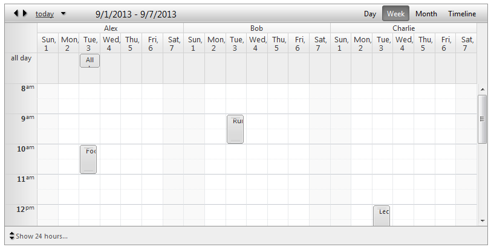

# Week View

The **Week view** is a standard table list, which shows appointments for specific week. Each day represents a vertical column with header showing its date formatted by the **ColumnHeaderDateFormat** property. Similarly to the **Day view** the **Week View** has also two different approaches for showing time slots representing the available hours:

* Business hours (default) - shows only the working hours (by default those values are from 9 am to 5 pm). Those values can be modified by the **WorkDayStartTime** and **WorkDayEndTime** properties.

* 24-hour - shows entire day hours ( from midnight to 23 o'clock including). Those values can be modified by the **DayStartTime** and **DayEndTime** properties.

The **All day** row is a special row positioned at the top (when enabled) to show the appointments last the entire day. That way you can have easy and fast access to your all day appointments and at same time they do not occupy the calendar area.

## Week View Settings:

* **DayStartTime**- Sets the day start time of the current view.

* **DayEndTime**- Sets the day end time of the current view.

* **WorkDayStartTime**- Sets the day start time of the business hours.

* **WorkDayEndTime**- Sets the day end time of the business hours.

* **ShowAllDayRow**- Shows/hides the **all day** row for all day appointments on the top of the calendar area.

* **EnableExactTimeRendering**- When it is enabled the appointment does not occupy the entire time slot if its start/end time does not match the time slot start/end time. The default value is **false** so the advanced edit form is the only way to determine what is exact appointment start/end time.

* **ShowAllDayInsertArea**- When enabled it keeps an extra space in **the all day** row where user to double click and have the ability to add an appointment.

* **ShowHiddenAppointmentsIndicator**- Indicates whether there is an appointment in current non-visible area. Clicking on that indicator will navigate to that area in order to show the appointment.

* **ShowInsertArea**- When enabled it keeps an extra space in each row where user to double click and have the ability to add an appointment.

* **ShowFullTime**- When enabled it shows entire day hours (from midnight to 23 o'clock including) instead of the business hours which is the default behavior.

* **FirstDayOfWeek**- The default first day of each week is Sunday andlast day is Saturday. When you set a new value only for **FirstDayOfWeek** it keeps last day to be Saturday, so some weekdays might be missing if **LastDayOfWeek** is not set explicitly.

* **LastDayOfWeek**- It works in absolute same way as **FirstDayOfWeek**.

## Grouping

**Week View** will provide full support for Resource and Date grouping, namely:

* No groping (Basic look)

* Grouped by Resource (**Horizontal**)

* Grouped by Resource (**Vertical**)

* Grouped by Date, Resource (**Horizontal**)

* Grouped by Date, Resource (**Vertical**)
