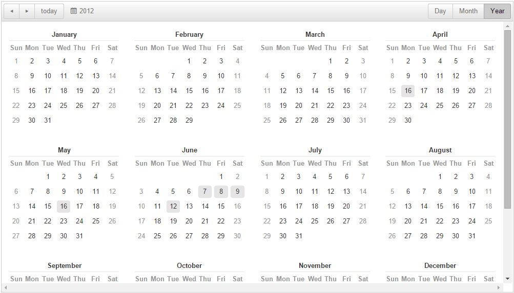
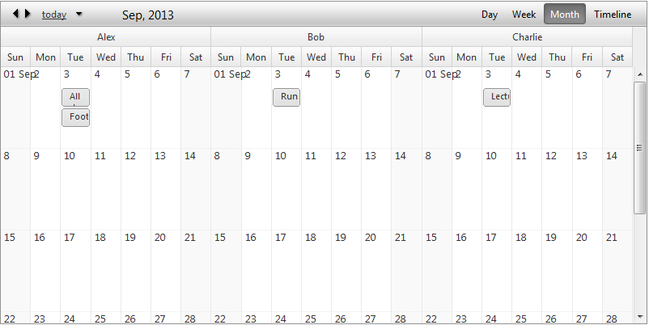
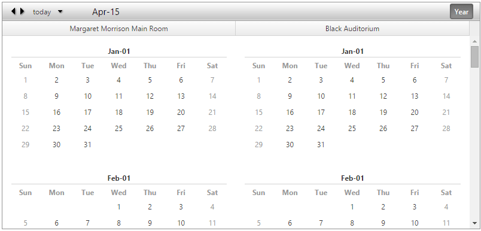

# Year View

The **Year View** allows you to revise and manage the appointments yearly. You can also group the months horizontally and vertically.
In addition to that, this view provides a Tooltip functionality, which allows you to revise the appointments for a given day. You can scroll the list of the appointments, by hovering the most top or most bottom part of the Tooltip.

>note The **Year View** is available only for the *Lightweight* and *Mobile* render modes.
>

## Year View Settings

* **ShowDateHeaders** - property that can be used to manage the visibility of the Date Headers for each column in the month.

* **ShowMonthHeaders** - property that can be used to manage the visibility of the Month Headers for the months of the Year View.

* **ColumnHeaderDateFormat** - Sets the date format for the Date Headers for each column in the month.

* **MonthHeaderDateFormat** - Sets the date format for the months listed in the Year View.

## Grouping

**Year View** provides support for Resource grouping namely:

* No Grouping (Basic look)
<!---->

* Grouped by Resource (**Horizontal**)
<!---->

* Grouped by Resource (**Vertical**)
<!---->

