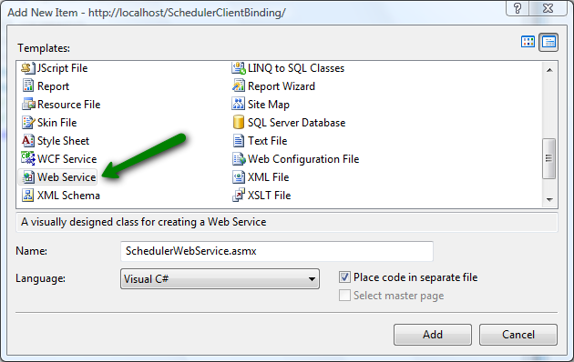

# Web Service Binding Overview

## 

Web-Service binding allows the developer to improve performance by minimizing the HTML output and removing the need ofa page refresh. In this mode RadScheduler does not postback to the page and the appointments are rendered on the client.

>caution Currently, **Resource Grouped** views (GroupBy="User") are supported when using Web Service data binding for all views (DayView, WeekView, MonthView, TimelineView) only if **ResourcePopulationMode="ServerSide"** .
>

Using Web Service binding requires a Data Provider. Check the SchedulerWebService.cs file for the implementationof the web service. You can find it here:

*[your local installation of Telerik.Web.UI controls]/Live Demos/App_Code*

Here is a step-by-step tutorial on how to bind RadScheduler to Web Services:

1. Create a new web site with VS 2008.

2. From the toolbox drag RadScheduler and a script manager to the default page. The generated markup will look like this:

	**ASP.NET**
	
		<form id="form2" runat="server">   
		   <asp:ScriptManager ID="ScriptManager1" runat="server">
		   </asp:ScriptManager>
		   <telerik:RadScheduler ID="RadScheduler1" runat="server" Height=""
			   HoursPanelTimeFormat="htt" ValidationGroup="RadScheduler1">
		   </telerik:RadScheduler>
		</form>      
	

3. Add a new **Web Service** file to your web site and rename it to **SchedulerWebService.asmx**.

	

	This will automatically add **SchedulerWebService.cs** in the **App_Code** folder.

4. In the SchedulerWebService.cs file define:

	* A Controller property of type WebServiceAppointmentController. This class is used as a wrapper for the Data Provider.

	* Public methods for creating, updating and deleting appointments, as shown below:

	**C#**
	     
		using System.Collections.Generic;
		using System.Web.Script.Services;
		using System.Web.Services;
		using Telerik.Web.UI;
		[WebService]
		[WebServiceBinding(ConformsTo = WsiProfiles.BasicProfile1_1)]
		[ScriptService]
		public class SchedulerWebService : WebService
		{
			private WebServiceAppointmentController _controller;

			/// 

			/// The WebServiceAppointmentController class is used as a facade to the SchedulerProvider.
			/// 

			private WebServiceAppointmentController Controller
			{
			 get
			 {
			  if (_controller == null)
			  {
			   _controller = new WebServiceAppointmentController(new XmlSchedulerProvider(Server.MapPath("~/App_Data/Appointments_Outlook.xml"), true));
			  }
			  return _controller;
			 }
			}
			[WebMethod]
			public IEnumerable<AppointmentData> GetAppointments(SchedulerInfo schedulerInfo)
			{
			 return Controller.GetAppointments(schedulerInfo);
			}
			[WebMethod]
			public IEnumerable<AppointmentData> InsertAppointment(SchedulerInfo schedulerInfo, AppointmentData appointmentData)
			{
			 return Controller.InsertAppointment(schedulerInfo, appointmentData);
			}
			[WebMethod]
			public IEnumerable<AppointmentData> UpdateAppointment(SchedulerInfo schedulerInfo, AppointmentData appointmentData)
			{
			 return Controller.UpdateAppointment(schedulerInfo, appointmentData);
			}
			[WebMethod]
			public IEnumerable<AppointmentData> CreateRecurrenceException(SchedulerInfo schedulerInfo, AppointmentData recurrenceExceptionData)
			{
			 return Controller.CreateRecurrenceException(schedulerInfo, recurrenceExceptionData);
			}
			[WebMethod]
			public IEnumerable<AppointmentData> RemoveRecurrenceExceptions(SchedulerInfo schedulerInfo, AppointmentData masterAppointmentData)
			{
			 return Controller.RemoveRecurrenceExceptions(schedulerInfo, masterAppointmentData);
			}
			[WebMethod]
			public IEnumerable<AppointmentData> DeleteAppointment(SchedulerInfo schedulerInfo, AppointmentData appointmentData, bool deleteSeries)
			{
			 return Controller.DeleteAppointment(schedulerInfo, appointmentData, deleteSeries);
			}
			[WebMethod]
			public IEnumerable<ResourceData> GetResources(SchedulerInfo schedulerInfo)
			{
			 return Controller.GetResources(schedulerInfo);
			}
		} 
		

5. Copy the **Appointments_Outlook.xml** file to the App_Data folder of your web site. It’s located at:**

	*[your local installation of Telerik.Web.UI controls]/Live Demos/App_Data*
	This file contains sample data for the XmlSchedulerProvider.

6. Set the **Path** and **ResourcePopulationMode** of RadScheduler's WebServiceSettings as shown below:

	**ASP.NET**
			
		<telerik:RadScheduler runat="server" ID="RadScheduler1" SelectedView="WeekView" SelectedDate="2009-02-02"
		  TimeZoneOffset="03:00:00" StartEditingInAdvancedForm="false">
		  <WebServiceSettings Path="SchedulerWebService.asmx" ResourcePopulationMode="ServerSide" />
		</telerik:RadScheduler> 
			

In addition you can find a full sample project for **"Web Services with Custom Provider"** by adding a Scenario Template. Follow these steps to add the scenario:

1. Right-click on the Web site name in Solution Explorer window. Select "RadControls for ASP.NET AJAX". From the submenu choose "Add RadScheduler Scenario".

1. **Scenario Wizard** appears with different scenarios. Choose **"Web Service with Custom Provider"**: 

1. Follow the wizard by pressing **"Next"** button and finally press **"Finish"**. A new .aspx page will be added to your project, depending on your choice in the Scenario Wizard. All necessary references will be added to your project.

1. Press **Ctrl+F5** and run the application.

# See Also

 * [Web Service binding blog post](http://blogs.telerik.com/tsvetomirtsonev/posts/09-02-20/Web_Service_binding_with_RadScheduler_for_ASP_NET_AJAX.aspx)
