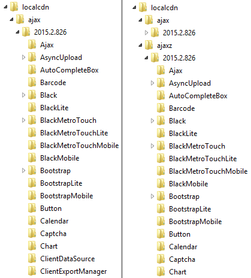

# Custom CDN Provider


## 

In case you want to use your own **CDN provider** for hosting RadControls script / css files you need to follow these steps:

1. Obtain the **CDN resource package** for your controls version. For example **Telerik_UI_for_ASP.NET_AJAX_2015_2_826_CDN_Resources.zip**.This file is available on demand and can be found where all product files for the RadControls for ASP.NET AJAX are located.
For this purpose you need to log in to your Telerik account and follow the steps below:
	1. Choose the *Products and Subscriptions* item from the menu;
	1. Select the product name (this can be the *DevCraft Ultimate* for example);
	1. From the newly opened page select the **Download** Installer and other resources* option;
	1. From the **RadControls for ASP.NET AJAX** section you will need to choose the *Browse all products files*;
	1. In the *Other* field section you can find the *CDN Resources*.

2. Extract the archive. The file structure will look like this:
	* Scripts
		* ajax/[version]
		* ajaxz/[version]
	* Skins
		* ajax/[version]
		* ajaxz/[version]
	* ReadMe
	Scripts/**ajaxz** folder contains the compressed (gzipped) javascript files. The Scripts/**ajax** folder contains the uncompressed javascript files for compatibility with older browsers (IE6).

3. Copy the content of the Scripts / Skins folder to your CDN host:
	* CDN
		* ajax/[version]
		* ajaxz[version]
		
 	Example: 
	 
 

4. Using **Uncompressed Resources** in IIS
	* Enable **Dynamic** and **Static** Compression
	* Configure **RadSCriptManager** and **RaRadStyleSheetManager**:
````ASPNET
<telerik:RadStyleSheetManager ID="RadStyleSheetManager1" runat="server" OutputCompression="Disabled">
        <CdnSettings BaseUrl="http://my.favorite.cdn" BaseSecureUrl="http://my.favorite.cdn" TelerikCdn="Enabled"  />
    </telerik:RadStyleSheetManager>       
<telerik:RadScriptManager ID="RadScriptManager1" runat="server" OutputCompression="Disabled">
	<CdnSettings BaseUrl="http://my.favorite.cdn" BaseSecureUrl="https://my.favorite.cdn" TelerikCdn="Enabled" />
    </telerik:RadScriptManager>
```` 

5. Using **Compressed Resources** in IIS
	* Disable **Dynamic** and **Static** compression
	* Set HTTP headers
		* Cache-Control: public, max-age=31536000
		* Expires - 1 year from the date of the request, if set dynamically. Far-future date (10 years) if set statically.
		* For all files in the Scripts/ajaxz folder: Content-Encoding: gzip
		* For .css files in the Skins/ajaxz folder: Content-Encoding: gzip

	* Set the **BaseUrl** attribute of the **CdnSettings** property to the domain name of your CDN and TelerikCdn="Enabled":
	````ASPNET
	<telerik:RadStyleSheetManager ID="RadStyleSheetManager1" runat="server">
			<CdnSettings BaseUrl="http://hvalyavi/cdn" TelerikCdn="Enabled"  />
		</telerik:RadStyleSheetManager>		
		
	<telerik:RadScriptManager ID="RadScriptManager1" runat="server">
		<CdnSettings BaseUrl="http://my.favorite.cdn" BaseSecureUrl="https://my.favorite.cdn" TelerikCdn="Enabled" />
		</telerik:RadScriptManager>
	````

You can also do it from web.config:
	````XML
<appsettings>  
	<add key="Telerik.ScriptManager.TelerikCdn.BaseUrl" value="http://my.favorite.cdn "  />   
	<add key="Telerik.ScriptManager.TelerikCdn.BaseSecureUrl" value="https://my.favorite.cdn "  />
</appsettings>
	````

Final web.config file:
	````XML
<?xml version="1.0" encoding="UTF-8"?>
<configuration>
  <system.webServer>
    <rewrite>
      <outboundRules>
        <rule name="Set Content Encoding header">
          <match serverVariable="RESPONSE_CONTENT_ENCODING" pattern=".*" />
          <conditions>
            <add input="{REQUEST_URI}" pattern="\.(css|js)$" />
          </conditions>
          <action type="Rewrite" value="gzip" />
        </rule>
      </outboundRules>
    </rewrite>
    <staticContent>
      <clientCache cacheControlMode="UseMaxAge" cacheControlMaxAge="00:10:15" />
    </staticContent>
    <urlCompression doStaticCompression="false" doDynamicCompression="false" />
  </system.webServer>
</configuration>
````	

Now the HTML output of the scripts tag will be like this:
````HTML
<script src="http://my.favorite.cdn/ajaxz/2015.2.826/Common/Core.js" type="text/javascript"></script>
<script src="http://my.favorite.cdn/ajaxz/2015.2.826/Common/jQuery.js" type="text/javascript"></script>
<script src="http://my.favorite.cdn/ajaxz/2015.2.826/Common/jQueryPlugins.js" type="text/javascript"></script>
<script src="http://my.favorite.cdn/ajaxz/2015.2.826/Common/Scrolling/ScrollingScripts.js" type="text/javascript"></script>
<script src="http://my.favorite.cdn/ajaxz/2015.2.826/Common/Navigation/NavigationScripts.js" type="text/javascript"></script>
<script src="http://my.favorite.cdn/ajaxz/2015.2.826/Menu/RadMenuScripts.js" type="text/javascript"></script>
<script src="http://my.favorite.cdn/ajaxz/2015.2.826/TabStrip/RadTabStripScripts.js" type="text/javascript"></script>
<script src="http://my.favorite.cdn/ajaxz/2015.2.826/ListBox/RadListBoxScripts.js" type="text/javascript"></script>
````

>note If you are using non-IIS Server configuration might be different.

# See Also

 * [Overview]()
