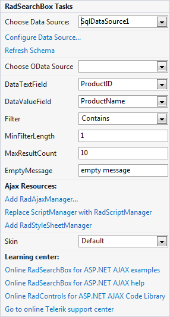

# Design-time

## Design Time

One can easily configure **RadSearchBox** through the Design Time Smart Tag.You have the option of choosing a Data Source and configuring the DataBinding properties as well asthe **Filter**, **MinFilterLength**, **MaxResultCount** and **EmptyMessage** properties. Once the Data Source has been chosen from the Smart Tag, the **DataTextField** and **DataValueField** additional fields will appear.
>caption 

