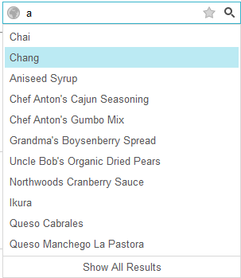

# AutoComplete


## AutoComplete

RadSearchBox has an __"EnableAutoComplete"__ property that controls the AutoComplete feature.

When __AutoComplete__ is disabled the control resembles a simple textbox. It can still have a collection of[image buttons](). The Default[Search button]() can also be visible. Pressing enter while typing in the control or clicking on the default search button will trigger the control’s default event, containing the value from the input field.


When __AutoComplete__ is enabled the control will filter an underlying database based on the text typed in the input and display the results in a dropdown, positioned under the SearchBox. In order for this to work the control must be bound to a datasource, ODataDataSource, WebService. It’s important to note that the results shown in the dropdown will not be instances of a public "Item" class. They will be directly rendered on the client with a property containing the dataItem attached to the rendered containing element. This dataItem will contain the additional values of the fields defined in the DataKeyNames Collection.

When __AutoComplete__ is __enabled__ the following properties can be used:

* __MinFilterLength__ - determines the minimum number of characters that should be typed in the searchbox input before the dropdown with autocomplete suggestions is shown. It's default value is 1 and in this case the drop-down will be shown immediately after the first character is typed.

* __MaxResultCount__ - sets the maximum number of results that will appear in the dropdown. Its default value is "-1", meaning that all the results found will be displayed in the dropdown. When this value is set, a "Show all results" button appears at the bottom of the dropdown Clicking this button will load all corresponding results.

When a __WebService__ binding scenario is implemented and you need to use the __"Show All Results"__ button and manage its visibility, the following requirements needs to be met:

* __MaxResultCount__ should be set to a desirable value.

* A custom calculation in the __WebService__ needs to be implemented, so you could check if the __"Show All Results"__ button needs to be visible. For example, if the entries count returned from the data source match the __MaxResultCount__ value - the __"Show All "Results"__ should not be visible. In this case you could toggle its Visible state by simply setting __EndOfItems__ property of the __SearchBoxData__ object in the following manner:


````C#
	
	       SearchBoxData data = new SearchBoxData();
	       data.EndOfItems = true;
	
````
````VB.NET
	
	    Dim data As New SearchBoxData()
	    data.EndOfItems = True
	
````


>note In cases when __MaxResultCount__ property is used in RadSearchBox and the __DataSourceSelect__ event is handled manually in order for __Show All Results__ button to appear correctly, we recommend that the amount of items that will be selected should be at least with one item greater than __MaxResultCount__ .
>


The control can also have a[Client]() or [Server]() ItemTemplate, as well as a DropDown [Header or Footer]() Template.
