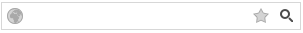

# Buttons Collection


RadSearchBox implements a button collection for additional custom buttons inside.

Each one of these buttons has the following inbuilt properties:


* **CommandName** - holds the command name of the button.

* **CommandArgument** - holds the command argument of the button.

* **Position** - sets the position of the image button relative to the input element. It has two possible values: **Left** and **Right**. The default value is **Left**.

* **ImageUrl** - the URL of the image that will be loaded in the button.

* **AlternateText** - the text that will be shown in case the image is not loaded.

When a button is clicked, an [onClientButtonCommand]() event is fired. If the server [OnButtonCommand]() event is declared it is fired as well.

Here is how a sample RadSearchBox would look like with additional buttons:


````ASPNET
		
<telerik:RadSearchBox RenderMode="Lightweight" runat="server" ID="RadSearchBox2" Width="300">
	<Buttons>
		<telerik:SearchBoxButton ImageUrl="../Img/icon_globe.png" CommandName="Globe"
			CommandArgument="globe" Position="Left" AlternateText="globe" />
		<telerik:SearchBoxButton ImageUrl="../Img/icon_favourites.png" CommandName="Favorites"
			CommandArgument="favorites" Position="Right" AlternateText="favorites" />
	</Buttons>
	<DropDownSettings Width="300" />
</telerik:RadSearchBox>
````


