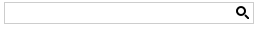

# Search Button

RadSearchBox contains a default "Search" button. Its visibility can be controlled easily with the **ShowSearchButton** property.

When clicked, the [OnClientSearch]() event is fired. If the server [OnSearch]() event is declared it is fired as well.
