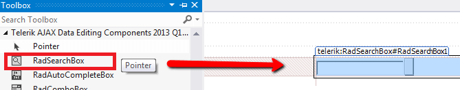
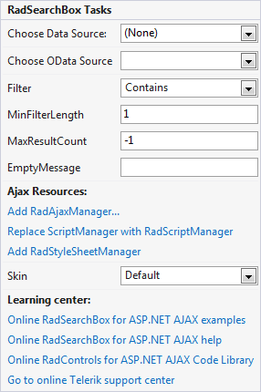
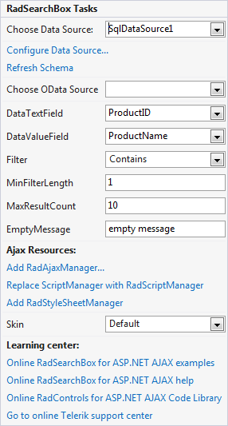

# Getting Started


## Creating a simple RadSearchBox

1. Drag a RadSearchBox from the Toolbox onto your web page.

	

1. From the [Design-time Smart Tag]() choose the desired Data Source using the **Choose Data Source** field.

	

1. Set the **DataTextField** and **DataValueField** according to your Data Source fields.

1. Choose the desired **Filter**,**MaxFilterLength**, **MaxResultCount** and **EmptyMessage** that will best suit your scenario.

	

1. Back in the Smart Tag, choose a **Skin** from the drop-down control.

1. Run the application. Type something in the RadSearchBox to see the search results.

## Sample declaration of RadSearchBox in Source mode

The following code demonstrates the RadSearchBox's markup in Source mode:

````ASPNET
<telerik:RadSearchBox RenderMode="Lightweight" runat="server" ID="RadSearchBox1"  />
</telerik:RadSearchBox>
````


>caption 


