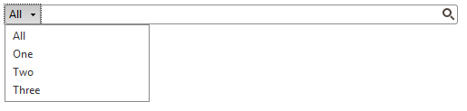

# Search Context Overview


## Overview

__Search Context functionality__ was added from Q2 2013 in order to provide context for the search operation. The search context is represented as a simple drop-down giving a choice to select a context item. This feature improves the performance and usability when searching in large data sets.

SearchBox's Search Context behaves as a standard DropDownList control with single selection. It has Items which are accessible server as well as client side.

````ASPNET
	   <telerik:RadSearchBox ID="RadSearchBox2" runat="server" Width="500" DataSourceID="SqlDataSource3" 
	            DataTextField="LastName" DataValueField="FirstName" DataContextKeyField="EmployeeID"  >
	        <Localization DefaultItemText="AllItems" LoadingItemsMessage="Some Loading" />
	        <SearchContext>
	            <Items>
	                <telerik:SearchContextItem Text="One" Key="1" />
	                <telerik:SearchContextItem Text="Two" Key="2" />
	                <telerik:SearchContextItem Text="Three" Key="3" />
	            </Items>
	        </SearchContext>
	    </telerik:RadSearchBox>
````


## Summary of features supported by RadSearchBox's Search Context

* __Data Binding__

* Declarative items – SeachContextItems could be defined in the markup or added dynamically from code-behind.

* [Server-side]() – server API for setting data source using DataSourceID/DataSource properties.

* [Client-side ]() – client API for population through Web services and integration with RadODataDataSource control.

* __Default "All" Item__ – Search Context renders an item which when selected won't provide context for the search operation. This item could be omitted if the __ShowDefaultItem__ property is set to False (it's True by default).

* __Loading Message__ - When the default item is not shown and the SearchContext's is populate from a web service or bound to the RadODataDataSource control, a message is shown in the input of the Search Context while the items are being loaded and initialized. Once loaded the message is removed and the first item in the list is selected.

* __Localization__ - both the text of the default items as well as the loading message could be localized through the __Localization-DefaultItemText__ and __Localization-LoadingItemsMessage__ properties.

* [Keyboard Support]() - Search Context has a fully functional keyboard support, which is available once the control is focused. In order to be able to focus the Search Context the __TabIndex__ property should be set.

* __ItemDataBoud__ - server-side event fired for every SearchContextItem create as a result of a binding to a data source.

* __ClientItemDataBoud__ - client-side event fired for every SearchContextItem create as a result of a binding to a RadODataDataSource control.

## Databinding Properties and Methods

When binding Search Context to a particular Data Source you will need to use the following properties.

* __DataSource__ property - set to an instance of your data source. This is mandatory when binding SearchContext at runtime.

* __DataSourceID__ property - set to the ID of your data source. This is mandatory when binding SearchContext declaratively.

* __DataTextField__ property - field name from the data source bound to the SearchContextItem's __Text__ property.

* __DataKeyField__ property - field name from the data source bound to the SearchContextItem's __Key__ property.

* __DataModelID__ property is used to set the ModelID when binding SearchContext to RadODataDataSource control.

## Summary of SearchContextItem's properties

* __Text__ – property defining the text of the SearchContextItem.

* __Key__ – this property defines the value which is used as a context when the search operation is performed and the SearchBox is bound to a data source control or RadODataDataSouce components.

* __ImageUrl__ – this property accepts a path to a physical image.

* __Selected__ – property defining the selected state of the item (Search Context could have only one selected item at a time).

## Search Context integration with RadSearchBox

The integration between the Search Context and the RadSearchBox could be achieved in two ways. When the SearchBox is bound to a data source component or RadODataDataSource control, the __DataContextKeyField__ property of the __SearchBox__ should be set to the data field which will be used as a context when the search operation is performed.

When the search results are provided from a web service or the server [DataSourceSelect]() event is being handled, the selected context item is availabe through the SelectedContextItem property of the input context parameter of the server or through the event arguments of the event.
