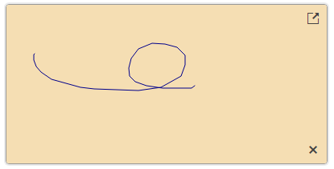

# Getting Started with the Telerik Signature for ASP.NET AJAX

The following article demonstrates how you can add the RadSignature control and customize it by setting some of its properties.



## Add a RadSignature Control

To add a RadSignature similar to the one shown in image above, follow the steps:

 - Add a `ScriptManager` control on a Web Form.

 - Use the `<telerik:RadSignature>` tag to declare the Signature component.

 - Use the exposed Control properties to set the desired Control structure and fine-tune its appearance:

You can set the desired button text via the `Text` property and specify a built-in icon via the `Icon` property.

````ASPX
<telerik:RadSignature runat="server" ID="RadSignature1" Height="200" Width="400"
    BackColor="Wheat" ForeColor="DarkBlue" FillMode="Outline" HideLine="true">
</telerik:RadSignature>
````

As a next step, you can check out the [Functionality]() of the Signature component.

## See Also

 * [Functionality]()
 * [RadSignature online demos](https://demos.telerik.com/aspnet-ajax/signature/examples/overview/defaultcs.aspx)


