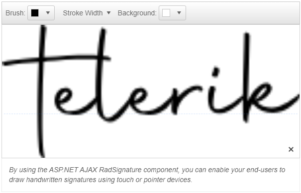

# WebForms Signature Overview

The Telerik RadSignature is a component designed to allow the users to create handwritten signatures.

RadSignature is available as of R1 2023 and it is a server-side WebForms wrapper over the [Kendo UI Signature for jQuery](https://docs.telerik.com/kendo-ui/controls/editors/signature/overview) widget.

## Key Features

 * [Appearance]() — The RadSignature control provides a number of options for modifying its background, and stroke colors and width.
 * [Validation and Form Integration]() — You can also use the Signature inside a submission form and validate its content.
 * [Image export]() — The Signature enables you to export it to a PNG file.

# See Also

 * [Getting Started]()
 * [RadSignature online demos](https://demos.telerik.com/aspnet-ajax/signature/overview/defaultcs.aspx) 
 * [ASP.NET AJAX Signature](https://www.telerik.com/products/aspnet-ajax/signature.aspx)
 * [First Steps with UI for ASP.NET AJAX]() 

