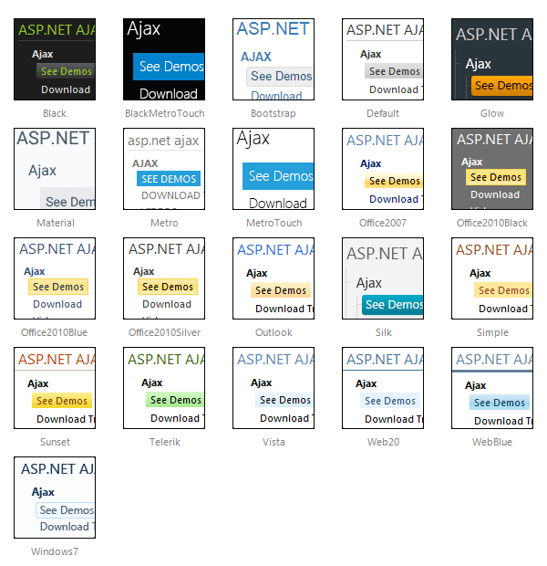

# Skins

## 

To make customizing the appearance of **RadSiteMap** as easy as possible, the control uses **skins.** A skin is a set of images and a CSS stylesheet that can be applied to the listbox elements (items, images, etc.) and defines their look and feel. To apply a skin to the sitemap, set its **Skin** property, either using the properties pane or the **RadSiteMap** Smart Tag.

The control comes with a number of built-in skins:

 

 @[template - Material skin is available only in Lightweight mode](/_templates/common/skins-notes.md#material-only-in-lightweight) 

