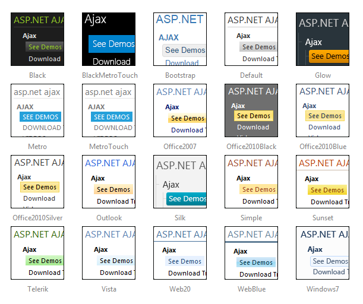

# Skins

## 

To make customizing the appearance of __RadSiteMap__ as easy as possible, the control uses __skins.__ A skin is a set of images and a CSS stylesheet that can be applied to the listbox elements (items, images, etc.) and defines their look and feel. To apply a skin to the sitemap, set its __Skin__ property, either using the properties pane or the __RadSiteMap__ Smart Tag.

The control comes with a number of built-in skins:

>note The __Hay__ , __Forest__ , __Sitefinity__ and __Transparent__ skins are obsolete and have been removed from the Telerik.Web.UI.Skins.dll assembly as of __Q1 2014__ . You can find more information on the matter in[this blog post](http://blogs.telerik.com/aspnet-ajax/posts/13-04-11/6-telerik-asp.net-ajax-skins-going-obsolete).
>

