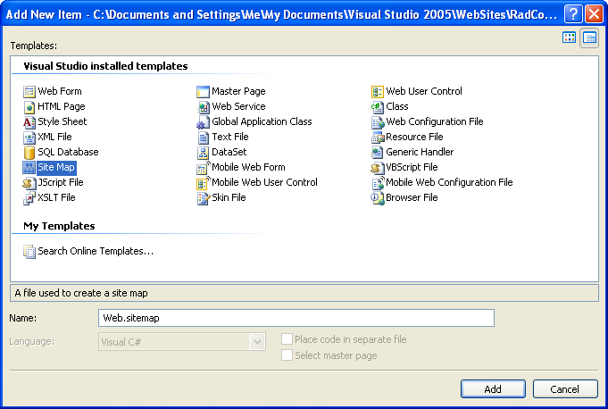

# Binding to SiteMapDataSource

Some data sources are inherently hierarchical. These include **SiteMapDataSource** and **XmlDataSource**. When data-bound to these types of data sources, **RadSiteMap** automatically creates the node hierarchy. There is no need to use the **DataFieldID** and **DataFieldParentID** properties.

## Binding to SiteMapDataSource

When binding to **SiteMapDataSource**, there is no need to set any properties to map fields from the data source to properties of the nodes. This is because site maps have a strictly defined structure.

The **SiteMapDataSource** control defines the structure of your Web site. By default the **SiteMapDataSource** control uses the default Site Navigation Provider. This provider lets you define the structure of your site, separating the real page structure of the site on one hand, and the UI presentation on the other.

The default site navigation provider is XML-based. It should stay in the root level of your project and should be named **web.sitemap**. Using the Site Navigation API provided in ASP.NET v2.0, you can write your own Site Navigation Provider and expose the navigation information from any back-end system, if needed.

## Setting the SiteMapDataSource control

Before adding the **SiteMapDataSource** control to your page, you need to add the Site Navigation Provider.

1. In the Solution Explorer, choose **Add New Item**... In the templates dialog, select **Site Map**:




2. Click the Add button. Visual Studio generates the web.sitemap file with the initial code:

````XML
<?xml version="1.0" encoding="utf-8" ?>
<sitemap xmlns="http://schemas.microsoft.com/AspNet/SiteMap-File-1.0">   
    <siteMapNode url="" title=""  description="">       
        <siteMapNode url="" title=""  description="" />       
        <siteMapNode url="" title=""  description="" />   
    </siteMapNode>
</sitemap>
````

3. Populate the Web.sitemap file. Here is an example:

````XML
<?xml version="1.0" encoding="utf-8" ?>
<sitemap xmlns="http://schemas.microsoft.com/AspNet/SiteMap-File-1.0"> 
    <siteMapNode url="https://www.telerik.com" title="Telerik" description="Telerik home page"> 
        <siteMapNode url="https://www.telerik.com/radcontrols" title="Telerik RadControls for ASP.NET" description="Telerik RadControls for ASP.NET" > 
            <siteMapNode url="https://www.telerik.com/radeditor" title="Telerik RadEditor" description="Telerik RadEditor control"/> 
        </siteMapNode> 
        <siteMapNode url="https://www.telerik.com/radnavigation" title="Telerik RadNavigation controls" description="Telerik RadNavigation controls" /> 
    </siteMapNode>
</sitemap>
````

>caution The url must be unique for each node. Avoid using backslashes (\\) for your URLs. Backslashes may cause problems with some browsers. Instead, we use the slash character (/).
>


4. Drag a **SiteMapDataSource** instance from the Toolbox to your Web page.

5. Set the **ShowStartingNode** property of the **SiteMapDataSource** component to **False**. This allows you to use multiple menu items at the root level.


## Binding RadSiteMap to SiteMapDataSource

1. From the **RadSiteMap** property pane, set the **DataSourceID** to the **ID** of the **SiteMapDataSource** control.

2. Each **siteMapNode** has three attributes which are mapped automatically to the respective properties:

* **url** - Maps to the **NavigateUrl** property.The path can be either relative (using the ~/), or absolute.

* **title** - Maps to the **Text** property.

* **description** - Maps to the **ToolTip** property.

To set additional properties or overwrite already populated fields, use the [NodeDataBound]() event. The example below overwrites the **TooTip** property with the Text value of the item and sets the **Value** property to a concatenated string of [Text] + [URL]:


````C#
protected void RadSiteMap1_NodeDataBound(object sender, Telerik.Web.UI.RadSiteMapNodeEventArgs e)
{   
    SiteMapNode sitemapNode = e.Node.DataItem as SiteMapNode;   
    e.Node.ToolTip = sitemapNode.Title + " - " + sitemapNode.Url ;
}		
````
````VB.NET
Protected Sub RadSiteMap1_NodeDataBound(ByVal sender As Object, ByVal e As Telerik.Web.UI.RadSiteMapNodeEventArgs)
    Dim sitemapNode As SiteMapNode = TryCast(e.Node.DataItem, SiteMapNode)
    e.Node.ToolTip = sitemapNode.Title + " - " + sitemapNode.Url
End Sub
````

