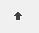

# RadSiteMap Item Builder

The __RadSiteMap Item Builder__ lets you populate your sitemap with a hierarchy of items that do not come from a separate data source. There are two ways to bring up the RadSiteMap Item Builder:

* From the __RadSiteMap__[Smart Tag](), click on the __Build RadSiteMap__ link.

* Right-click on the __RadSiteMap__ component and select __Build RadSiteMap__ from its context menu.

## RadSiteMap Item Builder

The __RadSiteMap Item builder__ lets you add, rearrange, configure, and delete sitemap items. These actions are initiated using the tool bar at the upper left of the Item builder:

The following table describes the controls in the tool bar:

| Button | Function |
| ------ | ------ |
||Adds a root item to the sitemap in the next available position. Root items are the top-level items (sitemap items with no parent item).|
||Adds a child item to the currently selected sitemap item. The child can belong to either a root item or another child item.|
||Deletes the currently selected sitemap item. When you delete a sitemap item, its child items are deleted as well.|
||Moves the currently selected sitemap item up a level, making it a sibling to its parent item (following the parent item).|
||Moves the currently selected sitemap item down a level, making it the child of its previous sibling.|
||Moves the currently selected sitemap item backward in its current list of siblings, so that it precedes the previous sibling.|
||Moves the currently selected sitemap item forward in its current list of siblings, so that it follows the next sibling.|

## 

__RadSiteMap Item Builder__

* __Text__ is the text of the item as it appears in the sitemap.

* __ToolTip__is the text of a tooltip that appears when the user hovers the mouse over the item.

* __Enabled__ controls whether the item is initially enabled or disabled.

* __Value__ lets you associate a text value with the sitemap item that you can use when programming the sitemap behavior.

* __NavigateUrl__ and __Target__ cause the sitemap item to automatically launch another Web page (specified by __NavigateUrl__) in the window specified by __Target__. If the __Target__ property is not set, the new Web page uses the current browser window.

* __CssClass__, __ClickedCssClass__, __DisabledCssClass__, __ExpandedCssClas__, and __FocusedCssClass__ control the appearance of the sitemap item when it is in its normal state, clicked, disabled, expanded, and holds input focus, respectively.

* __ImageUrl__, __ImageClickedUrl__, __DisabledImageUrl__, __ExpandedImageUrl__, and __HoveredImageUrl__ let you specify an image that appears on the left of the sitemap item when it is in its normal state, clicked, disabled, expanded, and when the mouse hovers over it, respectively.
