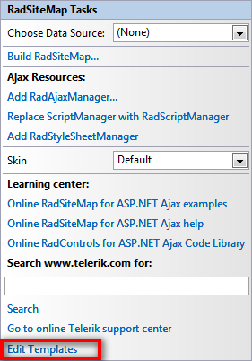
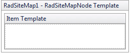

# Template Design Surface

## 

The __Template Design Surface__ lets you design templates for the items that appear in the sitemap. There are two ways to display the Template Design Surface:

* Choose __Edit Templates__ from the RadSiteMap [Smart Tag]():

* Choose __Edit Template__ from the RadSiteMap context menu and select the type of template you want to edit:

Either way, The Template Design Surface appears:

On the design surface, you can drag any controls from the toolbox, as well as typing any literal text. By moving to Source view, you can add other HTML content to the template and set attributes to display the item's value.

When you have finished designing your template, choose __End Template Editing__ from the __RadSiteMap__ context menu or Smart Tag.
