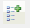
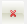
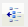

# Smart Tag

The **RadSiteMapDataSource** Smart Tag allows easy access to frequently needed tasks. You can display the Smart Tag by right clicking on a **RadSiteMapDataSource** control in the design window, and choosing **Show Smart Tag**. The Smart Tag looks like the following:

## Create a new SiteMap

Clicking on the "**Create a New SiteMap**" link will open the SiteMap Editor.

The SiteMap Editor lets you add, rearrange, drag, configure, and delete sitemap items. These actions are initiated using the vertical tool bar at the right of the editor, or the buttons between the two treeview areas. Direct drag-and-drop operations are also supported.

The following table describes the controls in the tool bar:

>caption  

| Button | Function |
| ------ | ------ |
||Adds a root node to the treeview in the next available position. Root nodes are the top-level nodes (treeview nodes with no parent item).|
||Adds a sibling to the selected node.|
||Adds a child node to the currently selected node. The child can belong to either a root node or another child node.|
||Deletes the selected node.|
||Makes the selected node a sibling of its parent.|
||Makes the selected node a child of its preceding sibling node.|
||Moves the selected node up amongst its siblings.|
||Moves the selected node down amongst its siblings.|
||Clears all sitemap node.|
||Moves the entire site's structure to the sitemap.|
||Moves the selected node to be used in the sitemap.|

The SiteMap Editor allows you to also set the Description, Title, and Url properties of the selected node through the **SiteMap Node Properties** box at the bottom:

Finally, at the bottom left corner is the "Export To Sitemap" button which allows you to save your sitemap in **Sitemap protocol** format that can be used by google and other such robots.

## Edit SiteMap

Clicking on the "**Edit SiteMap**" link of the smart tag dialog will also open the SiteMap Editor. However, the difference in the editor in this case will be that the Sitemap treeview on the right will be already populated with the structure of the file specified by the **SiteMapFile** property.
