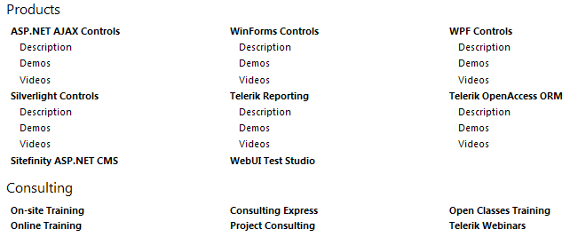
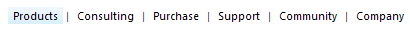

# Layout

## 

Each level can be rendered in one of the two layout modes:

* __List__ - this the default mode. Several properties are can be applied only to this mode:

* __RepeatColumns__ - set it to an integer number to control the number of columnsThe image below shows how RadSiteMap will look like if you set the __RepeatColumns__ of the second level to 3:

* __RepeatDirection__ - set it to either __SiteMapRepeatDirection.Vertical__ or __SiteMapRepeatDirection.Horizontal__ to control how the items can be repeated in columnsThe image below shows how RaSiteMap will look like if you set the __RepeatDirection__ to Horizontal (the RepeatColumns is still set to 3).Note how the WinForms Controls node is __under__ the ASP.NET Ajax Controls

* __AlignRows__ - set it to __True__ to align the rows and False otherwise

* __Flow__ - displays the RadSiteMapNodes __linearly__. If applied to a given level, the rendering process stops at that level. For example, if you have RadSiteMap with 3 levels hierarchy and you apply flow level to the second one, the third level won't be rendered. When using __Flow__ layout, the nodes are separated by a text separator which is by default a pipe (|). You can change it using the __SeparatorText__ property of the __SiteMapLevelSetting__ class. If you need to use an image or any other control as a separator you can rely on the __SeparatorTemplate__ property of the SiteMapLevelSetting class.

The image below shows how RadSiteMap looks like when the layout of the first level (level 0) is set to __Flow__:

