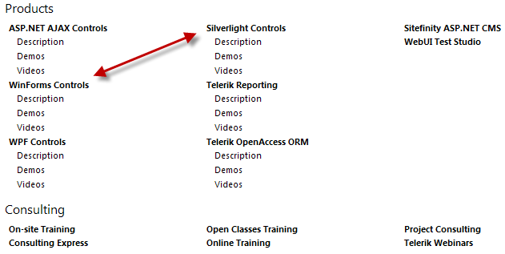
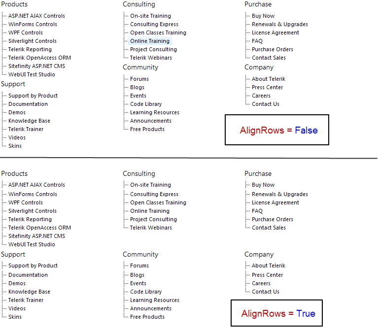

# Layout

## 

Each level can be rendered in one of the two layout modes:

* **List** - this the default mode. Several properties are can be applied only to this mode:

* **RepeatColumns** - set it to an integer number to control the number of columnsThe image below shows how RadSiteMap will look like if you set the **RepeatColumns** of the second level to 3:

* **RepeatDirection** - set it to either **SiteMapRepeatDirection.Vertical** or **SiteMapRepeatDirection.Horizontal** to control how the items can be repeated in columnsThe image below shows how RaSiteMap will look like if you set the **RepeatDirection** to Horizontal (the RepeatColumns is still set to 3).Note how the WinForms Controls node is **under** the ASP.NET Ajax Controls

* **AlignRows** - set it to **True** to align the rows and False otherwise

* **Flow** - displays the RadSiteMapNodes **linearly**. If applied to a given level, the rendering process stops at that level. For example, if you have RadSiteMap with 3 levels hierarchy and you apply flow level to the second one, the third level won't be rendered. When using **Flow** layout, the nodes are separated by a text separator which is by default a pipe (|). You can change it using the **SeparatorText** property of the **SiteMapLevelSetting** class. If you need to use an image or any other control as a separator you can rely on the **SeparatorTemplate** property of the SiteMapLevelSetting class.

The image below shows how RadSiteMap looks like when the layout of the first level (level 0) is set to **Flow**:

