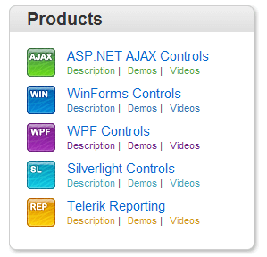
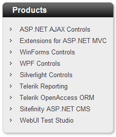
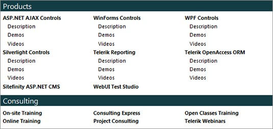

# Sitemap Overview

## 

Improve you web page load time with the flexible, lightweight **RadSiteMap** control for ASP.NET AJAX. This UI component with its efficient semantic rendering gives you a lightning fast solution and highly optimized HTML output. With the ease of Telerik’s SiteMap for ASP.NET AJAX you can organize and list the pages on your web site, customize the layout, choose from a variety of appearance options and templates. Add value to your web site by optimizing it for crawler and search engines with no extra development effort.

**Semantic Rendering for Minimal HTML**

The Telerik ASP.NET SiteMap implements a highly efficient semantic rendering, which results in minimum HTML output and dramatically improves performance.

**Flexible layouts**

You can configure the layout of RadSiteMap in a variety of modes. The nodes can be viewed in either list or flow state. By selecting the flow property items in the group will be arranged in rows one after the other, instead of displaying them as a list. End-users can also alternate between single, multi-column, horizontal or vertical view. In addition you can display node lines in a fashion similar to RadTreeView and collapse the hierarchy.

**Templates**

The ASP.NET SiteMap by Telerik allows you to define a collection of dynamic templates that customize the presentation of the hierarchy and the individual nodes. You can apply per-level, per-node and global templates and add extra information, such as images, links to additional sources, etc.

**Appearance**

RadSiteMap is shipped with a rich set of skins that allow you to easily build slick interfaces with the look-and-feel of Windows Vista, Office 2007, Outlook, etc. The skins can be easily switched using a single property. This significantly simplifies styling even for complex configurations.

**Industry-Best Cross-Browser Support**

Following our long tradition of industry best cross-browser support, Telerik ASP.NET SiteMap doesn’t make an exception. The component supports all major browsers, including Internet Explorer, Firefox, Safari, Opera and Google Chrome and produces identical results.

**Search Engine Friendly**

RadSiteMap completely follows the principles of Search Engine Optimization. The control's innovative rendering generates semantic lists and standard <a> tags, which are properly recognized and highly valued by search engines. As a result, all content accessible through this control will be automatically indexed and ranked with no extra effort required from the developer.

**Codeless Test Automation for RadSiteMap**

Now you can record, execute and debug functional tests for RadSiteMap without leaving the familiar Visual Studio environment. Telerik WebUI Test Studio is an advanced click and play web application testing tool specialized for automating ASP.NET AJAX applications. The Studio ships with special translators for Telerik RadControls for ASP.NET AJAX.

