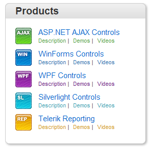

# Templates Overview

Templates allow you to embed any content inside a RadSiteMapNode. For example:

* HTML markup

* ASP.NET server controls

* other third-party controls (other Telerik RadControls for ASP.NET Ajax for example) 

## When to use Templates

Normally, **RadSiteMap** allows great flexibility with regard to the functionality and appearance of the nodes. Use Templates to embed complex elements (such as ASP .NET controls) inside your nodes. Templates are also a great way to avoid setting too many properties to each node explicitly.




Here is the RadSiteMap declaration (the CSS styles are omitted for simplicity):

````ASPNET
<telerik:RadSiteMap runat="server" ID="RadSiteMap3" Skin="Default" DataSourceID="SiteMapDataSource"
    OnNodeDataBound="RadSiteMap1_NodeDataBound">
    <LevelSettings>
        <telerik:SiteMapLevelSetting Level="0" MaximumNodes="1">
            <NodeTemplate>
                <h3 class="Header">
                    <%# DataBinder.Eval(Container.DataItem, "title") %></h3>
            </NodeTemplate>
        </telerik:SiteMapLevelSetting>
        <telerik:SiteMapLevelSetting Level="1" MaximumNodes="5">
            <NodeTemplate>
                <!--You can bind to an attribute of the data item               
                 using the following syntax: Eval("[attribute key]")-->
                <div class="ContentHolder">
                    <!-- The href would normally be bound to <%# DataBinder.Eval(Container.DataItem, "url") %> -->
                    <a href='#'>
                        <%# DataBinder.Eval(Container.DataItem, "title") %>
                    </a>
                </div>
            </NodeTemplate>
        </telerik:SiteMapLevelSetting>
        <telerik:SiteMapLevelSetting Level="2" Layout="Flow" />
    </LevelSettings>
</telerik:RadSiteMap>
````


**RadSiteMap** supports the following node templates:

* Default (global) node template

````ASPNET
<telerik:RadSiteMap ID="RadSiteMap2" runat="server" DataSourceID="SiteMapDataSource">
    <DefaultLevelSettings>
        <NodeTemplate>
            The template here
        </NodeTemplate>
    </DefaultLevelSettings>
</telerik:RadSiteMap>
````


* Per level node template

* Per node template


**RadSiteMap** supports the following separator templates:

* Default (global) separator template

````ASPNET
<telerik:RadSiteMap ID="RadSiteMap2" runat="server" DataSourceID="SiteMapDataSource">
    <DefaultLevelSettings>
        <SeparatorTemplate>
            Default separator template
        </SeparatorTemplate>
    </DefaultLevelSettings>
</telerik:RadSiteMap>
````


* Per level separator template

* Per node separator template

````ASPNET
<telerik:RadSiteMap ID="RadSiteMap2" runat="server" DataSourceID="SiteMapDataSource">
    <Nodes>
        <telerik:RadSiteMapNode Text="Telerik" NavigateUrl="https://www.telerik.com">
            <SeparatorTemplate>
                Separator template
            </SeparatorTemplate>
        </telerik:RadSiteMapNode>
    </Nodes>
</telerik:RadSiteMap>
````
                
