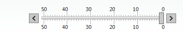

# Right-to-left Support

The **RadSlider** fully supports right-to-left (RTL) language locales. In order to turn on the RTL support you should set its **IsDirectionReversed** property to **true** as well as **dir=rtl to the html or body** elements or to its direct parent.

````ASP.NET
<div dir="rtl">
	<telerik:RadSlider runat="server" Skin="Simple" ID="RadSlider1" Orientation="Horizontal" Width="300"
		Height="50" MinimumValue="0" MaximumValue="50" LargeChange="10" ItemType="Tick" IsDirectionReversed="true"
		EnableServerSideRendering="true">
	</telerik:RadSlider>
</div>
````



## See Also

 * [See this live in an online demo](http://demos.telerik.com/aspnet-ajax/slider/examples/righttoleft/defaultcs.aspx)
