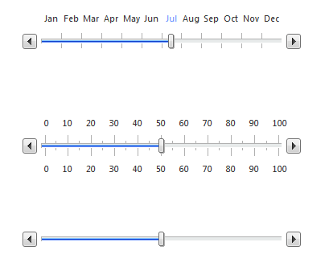
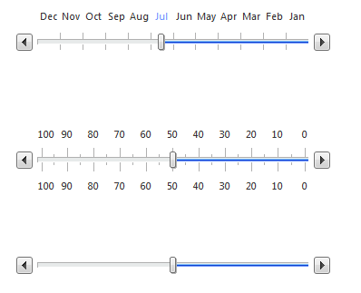
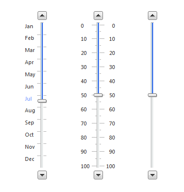
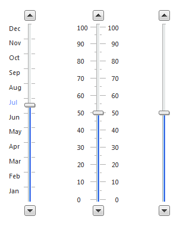

# Controlling Appearance

There are a number of ways to customize the look and feel of **RadSlider**:

* To change the overall look and feel of the RadSlider control, set its **Skin** property.

* To change the layout of **RadSlider**, use the **Orientation** property.

* To change the visibility of handles, use the **ShowDragHandle**, **ShowDecreaseHandle** and **ShowIncreaseHandle** properties.

* To show two drag handles use the **IsSelectionRangeEnabled** property

* To reverse the slider set the **IsDirectionReversed** property to **true**

* To Disable the slider set the **Enabled** property to **false**

## Visual Examples:

## Horizontal Slider:
>caption 

*From top to bottom: Slider with Items, Slider with Ticks, Slider*

## Reversed Horizontal Slider:
>caption 

*From top to bottom: Slider with Items, Slider with Ticks, Slider*

## Vertical Slider
>caption 

*From left to right: Slider with Items, Slider with Ticks, Slider*

## Vertical Slider Reversed
>caption 

*From left to right: Slider with Items, Slider with Ticks, Slider*

## Slider with two Drag Handles
>caption 

## Disabled Slider
>caption 

# See Also

 * [Skins]()

 * [Tutorial: Creating a Custom Skin]()

 * [Understanding the Skin CSS File]()

 * [CSS Classes]()
