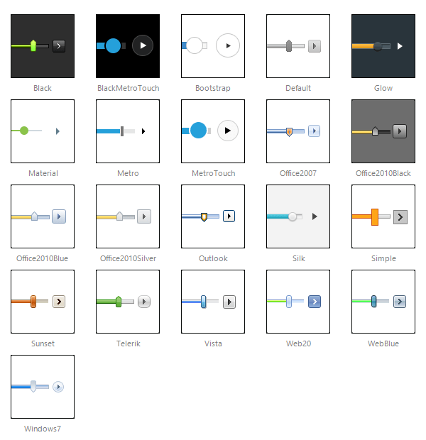

# Skins

To make customizing the appearance of **RadSlider** as easy as possible, the control uses **skins**. A skin is a set of images and a CSS stylesheet that are applied to the HTML elements which make up the RadSlider control, defining the look and feel.

To apply a skin, set the **Skin** property of the **RadSlider** control. Set the **Skin** property using the Properties Window or the control's [Smart Tag]().

**RadSlider** is installed with a number of preset skins. These are shown below:

 

 @[template - Material skin is available only in Lightweight mode](/_templates/common/skins-notes.md#material-only-in-lightweight) 

## Customizing Skins

You can tweak the existing skins, or create your own. Each skin has two main elements: images and a stylesheet. When creating your own, it is a good idea to start with the stylesheet for an existing skin and alter that. See the [Tutorial: Creating a Custom Skin]() topic for a step-by-step walk through. To use your own skin

1. Add the new CSS file to your project.

1. Drag and drop the CSS file from the Project Explorer onto your Web page.

1. Set the **EnableEmbeddedSkins** property of the controls that use the skin to **False**.

The stylesheet for a **RadSlider** skin has the name **RadSlider.[SkinName].css** and can be found in the **...Skins/[SkinName]** directory. The images are found in the **...Skins/[SkinName]/Slider** directory. For example, the stylesheet for the "Black" skin is called Slider.Black.css and is located in the ...Skins/Black directory. The images are found in the ...Skins/Black/Slider directory. The images are referenced by name from within the stylesheet.

For information on the CSS File structure, see the [Understanding the Skin CSS File]() topic.

## See Also

 * [Tutorial: Creating a Custom Skin]()

 * [Understanding the Skin CSS File]()

 * [CSS Classes]()

 * [Telerik ThemeBuilder for ASP.NET AJAX](https://themebuilder.telerik.com/)

