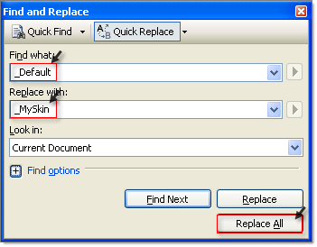

# Tutorial: Creating a Custom Skin

The following tutorial demonstrates creating a custom RadSlider skin, using the default skin as a base. This new skin will take the appearance of the slider from its default look: 

...to the following:

See [Understanding the Skin CSS File]() for more information on specific CSS file properties. 

## Prepare the Project

1. In a new AJAX enabled application web form, add a **RadSlider**. Set the **EnabledEmbeddedSkins** property to **false**.

1. In the Solution Explorer, create a new "MySkin" directory in your project.

1. Copy the default RadSlider skin files from the installation directory to the "MySkin" directory; copy both the \Slider directory that contains the images for this skin and the Slider.Default.css file that defines the skin styles.

	>note The file path will typically be similar to this example: _\Program Files\Telerik\<Your Version of Telerik UI for ASPNET>\Skins\Default_.
	
1. The solution should now look something like the screenshot below:
	
	
	
1. In the Solution Explorer, rename "Slider.Default.css" to "Slider.MySkin.css".

	
	
## Edit the Skin CSS File

1. Open "Slider.MySkin.css" for editing in Visual Studio.

1. Press **Control-H** to invoke the Find and Replace dialog. 

1. Set **Find what**: to "_Default", **Replace with**: to "_MySkin", and **Look in**: to **Current Document**.

1. Click the **Replace All** button. 

1. 

1. The style sheet should now look something like the example below.

1. 

1. From the Solution Explorer drag the "Slider.MySkin.css" to the design surface of the form. This step will automatically add a reference to the page `<head>` tag as a `<link>` as shown in the screenshot below.

	
	
1. Change the **Skin** property of your RadSlider control to "MySkin". 

1. Run the application. The new skin looks just like the Default skin:

	
	
1. **Modify the Graphics**

1. In MSPaint or other drawing tool of your choice, open the file "DragHandle.gif" for editing. This image contains the slider drag handle in three states. Change the coloring to use a blue color as a base and save the file. The coloring changes the image from this:

	
	
1. ... to looking something like this:

	
		
1. Also edit the "Handles.gif" graphic to use blue coloring so that it changes from the starting appearance:

	
	
1. ...to looking something like this:

	
	
## Edit the Skin CSS File

1. Run your application and notice the new handle colors:

	
	
1.  The selection and track areas are dark brown and white respectively. You will need to modify the stylesheet to alter the selection and track areas. Before starting to modifying the style sheet, take a look at this abbreviated DOM-tree of **RadSlider**:

	**HTML**
	
		
  
		   
  
			   ...   
			   
           
				   
 
         
				   ...
			   
        
			   ...  
		   

		

		
	The classes that control the appearance for the selected region (to the left of the drag handle) and the track (visible on the right of the drag handle) are "rslSelectedregion" and "rslTrack" respectively. Change "rslSelectedregion" to use "Blue" for the background color.
	
	**CSS**
	
		.RadSlider_MySkin .rslHorizontal .rslSelectedregion
		{ 
			background:Blue none repeat scroll 0%; 
			height:6px;
		}

1. Change the "rslTrack" style to use "AliceBlue" for the background color, border-bottom to use "Blue" color and border-top to use "DarkBlue".

	**CSS**
		
		.RadSlider_MySkin .rslHorizontal .rslTrack
		{ 
			background:AliceBlue none repeat scroll 0%; 
			border-bottom:1px solid Blue; 
			border-top:1px solid DarkBlue; 
			height:3px; 
			left:12px; 
			margin-top:6px; 
			top:0pt;
		}
		
1. Press F5 to run the application. Notice that both the graphics and background colors have changed.

	
	
For more information about Cascading Style Sheets, see

* [World Wide Web Consortium CSS specifications](http://www.w3.org/Style/CSS/)
* [W3 Schools CSS tutorial](http://www.w3schools.com/css/default.asp)
* [Guide to Cascading Style Sheets](www.htmlhelp.com/reference/css/)

## See Also

* [Understanding the Skin CSS File]()

* [CSS Classes]()

 
