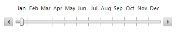

# Understanding the Skin CSS File


Styles for __Telerik controls__ are defined using Cascading Style Sheet (CSS) syntax. Each style consists of a selector that identifies an HTML element to be styled, and property/value pairs that describe each of the style specifics, e.g. color, padding, margins, etc. See the [CSS Skin File Selectors]() topic for more information on the specific CSS selectors used for __RadSlider__ skins.

Each style maps to a "class" attribute in an HTML tag. For example, consider the HTML rendering of a __RadSlider__ control:

## Rendering Horizontal Slider with Items:

The slider control is rendered within a wrapping DIV with__id="RadSliderWrapper_RadSlider_Items"__ which specifies the using of RadSlider with Items. For proper rendering two classes were also added:__class=”rslHorizontal rslMiddle”__. The __rslHorizzontal__ class defines that the slider will be in horizontal position and the __rslMiddle__ class is used when you want to render __Slider with Items__ or__Slider with Ticks__. The slider options are rendered with an unordered list. You have four classes for the LI element which are __rslItem__ – for each LI element,__rslItemFirst__ – only for the first LI element, __rslItemSelected__ – only for the selected element and __rslItemLast__- only for the last LI element.

The Handles within the slider are rendered with anchor elements with classes specifying that it is a handle and its functionality – increasing or decreasing the slider: __rslHandle__, __rslDecrease__, __rslIncrease__.

Rendering of the other RadSlider options use the same or very similar HTML semantics. The difference is in the used CSS classes that specify the __Orientation__, __Direction__, __Position__, number of __Drag handles__, __Enabling__ or __Disabling__ the server-side rendering and __RadSlider__ itself. The CSS classes are named sensitively and it is easy to predict what their exact usage is.
>caption 



````ASPNET
	    <div id="RadSliderWrapper_RadSlider_Items" unselectable="on" style="width: 350px;
	        height: 70px;" class="rslHorizontal rslMiddle">
	        <a id="RadSliderDecrease_RadSlider_Items" href="#" class="rslHandle rslDecrease"
	            title="Decrease"><span>Decrease</span> </a>
	        <ul class="rslItemsWrapper">
	            <li class="rslItem rslItemFirst rslItemSelected" unselectable="on" style="width: 24px;
	                height: 70px;"><span>Jan</span> </li>
	            <li class="rslItem" unselectable="on" style="width: 24px; height: 70px;"><span>Feb</span>
	            </li>
	            <li class="rslItem" unselectable="on" style="width: 24px; height: 70px;"><span>Mar</span>
	            </li>
	            <li class="rslItem" unselectable="on" style="width: 24px; height: 70px;"><span>Apr</span>
	            </li>
	            <li class="rslItem" unselectable="on" style="width: 24px; height: 70px;"><span>May</span>
	            </li>
	            <li class="rslItem" unselectable="on" style="width: 24px; height: 70px;"><span>Jun</span>
	            </li>
	            <li class="rslItem" unselectable="on" style="width: 24px; height: 70px;"><span>Jul</span>
	            </li>
	            <li class="rslItem" unselectable="on" style="width: 24px; height: 70px;"><span>Aug</span>
	            </li>
	            <li class="rslItem" unselectable="on" style="width: 24px; height: 70px;"><span>Sep</span>
	            </li>
	            <li class="rslItem" unselectable="on" style="width: 24px; height: 70px;"><span>Oct</span>
	            </li>
	            <li class="rslItem" unselectable="on" style="width: 24px; height: 70px;"><span>Nov</span>
	            </li>
	            <li class="rslItem rslItemLast" unselectable="on" style="width: 24px; height: 70px;">
	                <span>Dec</span> </li>
	        </ul>
	        <div unselectable="on" id="RadSliderTrack_RadSlider_Items" class="rslTrack" style="width: 298px;
	            height: 6px;">
	            <div unselectable="on" id="RadSliderSelected_RadSlider_Items" class="rslSelectedregion"
	                style="width: 12px;">
	                <!-- -->
	            </div>
	            <a id="RadSliderDrag_RadSlider_Items" href="#" class="rslDraghandle" title="Drag"
	                style="cursor: pointer; left: 8px;"><span>Drag</span> </a>
	        </div>
	        <a id="RadSliderIncrease_RadSlider_Items" href="#" class="rslHandle rslIncrease"
	            title="Increase"><span>Increase</span> </a>
	    </div>
````


# See Also

 * [Tutorial: Creating a Custom Skin]()

 * [CSS Classes]()
