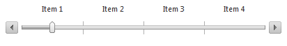
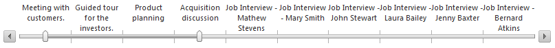

# Client-side Data Binding

This article introduces the client-side data binding feature of the **RadSlider** control.

## Getting Started with RadSlider's Client-side Data Binding

You can data bind the slider to various types of data sources to populate its items when its **ItemType** property is set to **Item**. You can use the **RadClientDataSource** control or call the **dataBind** method after the data source is specified via the **set_dataSource** method, shown in the slider's [client-side API]().

You should define the **TextField**, **ValueField**, **ToolTipField** properties of the bound slider items in the **ItemBinding** inner tag of the bound slider. These properties provide the field names from which the slider takes the data for each item, as shown in **Example 1** and **Example 2**.

There are three events related to the client-side data binding:

* [OnClientDataBound]()

* [OnClientItemDataBinding]()

* [OnClientItemDataBound]()

The following two sections will provide more details about the client-side data binding of the slider.

## Simple Data Binding

When you have already retrieved the desired data source from a web service or from another appropriate source, you can use the following approach to databind it to the slider. **Example 1** demonstrates how you can use a simple JavaScript array for data binding by passing the array as a parameter of the **set_dataSource** function of **RadSlider** and then calling **dataBind**. You need to set the properties in the **ItemBinding** composite property of the slider with the fields in the data source that will populate the corresponding slider item fields. The result of this implementation is shown in **Figure 1**.

>caption Figure 1: Slider that is data bound to a simple array.



>caption Example 1: Data binding a slider to an array on the client.

````ASP.NET
<script type="text/javascript">
	var datasource = [
		{ ItemName: "Item 1", ItemValue: 1, ItemToolTip: "Item with value 1." },
		{ ItemName: "Item 2", ItemValue: 2, ItemToolTip: "Item with value 2." },
		{ ItemName: "Item 3", ItemValue: 3, ItemToolTip: "Item with value 3." },
		{ ItemName: "Item 4", ItemValue: 4, ItemToolTip: "Item with value 4." }
	];

	function OnClientLoad(sender, args) {
		sender.set_dataSource(datasource);
		sender.dataBind();
	}
</script>

<telerik:RadSlider RenderMode="Lightweight" runat="server" ID="RadSlider1" Width="400px" Height="70px" ItemType="Item" 
	OnClientLoad="OnClientLoad">
	<ItemBinding TextField="ItemName" ToolTipField="ItemToolTip" ValueField="ItemValue">
	</ItemBinding>
</telerik:RadSlider>
````

## Using a RadClientDataSource Control for Data Binding

The **RadClientDataSource** control allows you to connect to a web service and fetch data that you can bind to any appropriate Telerik control. After configuring the client data source, all you need is to set its **ID** to the **ClientDataSourceID** property of the slider control. You can see this approach in **Example 2** and the rendered result in **Figure 2**.

>caption Figure 2: Slider that is data bound to RadClientDataSource.



>caption Example 2: Using **RadClientDataSource** control for data binding a rotator.

````ASP.NET
<telerik:RadClientDataSource runat="server" ID="RadClientDataSource1" PageSize="10" AllowPaging="true">
	<DataSource>
		<WebServiceDataSourceSettings BaseUrl="http://demos.kendoui.com/service/">
			<Select Url="Meetings" DataType="JSONP" />
		</WebServiceDataSourceSettings>
	</DataSource>
</telerik:RadClientDataSource>

<telerik:RadSlider RenderMode="Lightweight" runat="server" ID="RadSlider2" Width="800px" Height="100px" ItemType="Item" IsSelectionRangeEnabled="true"
	SelectionStart="0" SelectionEnd="3" ClientDataSourceID="RadClientDataSource1">
	<ItemBinding TextField="Title" ToolTipField="Description" ValueField="Date"></ItemBinding>
</telerik:RadSlider>
````

## See Also

 * [RadSlider Client-Side Basics]()

 * [RadSlider Client Object]()

 * [RadSlider OnClientDataBound]()

 * [RadSlider OnClientItemDataBinding]()

 * [RadSlider OnClientItemDataBound]()
 
 * [RadClientDataSource Overview]()
