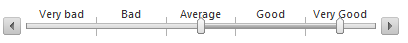

# Behavior

## ItemType set to None or Tick

To control slider behavior, set the **MinimumValue**, **MaximumValue** and **Value** properties. **MinimumValue** and **MaximumValue** limit the lower and upper bounds that **Value** may be set at any value between them.

>note MaximumValue must be greater than MinimumValue to avoid generating an error.

In Example 1 below, **Value** can not be less than zero or more than thirty.

The **LargeChange** property controls the increment of the **Value**. For example, if **Value** is 50, **LargeChange** is 10 and the user clicks to the right of the drag handle, the new **Value** will be 60. If **LargeChange** is set to **0** the value will move to the point at which the user clicked. In this case the large ticks that denote the large change intervals are not rendered.

The **SelectedRegionStartValue** property determines from which value will start the selected region of the slider. By default it is set to the minimum value of the slider.

>caption Example 1: Configuring RadSlider in the markup.

````ASP.NET 
<telerik:RadSlider
   ID="RadSlider1"
   runat="server"
   MaximumValue="40"
   MinimumValue="0"
   Value="2"
   LargeChange ="10"
   SelectedRegionStartValue="0"
/>		
````

>caption Example 2: Configuring RadSlider from the code behind.

````C#
RadSlider1.MinimumValue = -12;
RadSlider1.MaximumValue = 12;
RadSlider1.Value = 2;
RadSlider1.LargeChange = 10;
RadSlider1.SelectedRegionStartValue = 0;
````
````VB
RadSlider1.MinimumValue = -12
RadSlider1.MaximumValue = 12
RadSlider1.Value = 2
RadSlider1.LargeChange = 10
RadSlider1.SelectedRegionStartValue = 0
````

## ItemType set to Item

By setting the **ItemType** property to **Item** type, you can define custom slider items and add them to the **Items** collection.

>note The **Value**, **SelectionStart** and **SelectionEnd** properties of RadSlider with **ItemType** set to **Item** represent the index in the **Items** collection of the currently selected item(s). **Example 3** and **Example 4** show how to get the selected item(s) programmatically.

Each slider item exposes the following properties:

1. **Text**—sets the text that the slider item displays;
1. **Value**—sets the value of the slider item;
1. **ToolTip**—sets the tooltip of the slider item;
1. **CssClass**—sets the CSS class that is applied to the slider item.

>caption Figure 1: Showcases the result from the code in Example 3.


>caption Example 3: Get the selected item by value.

````ASP.NET
<telerik:RadSlider RenderMode="Lightweight" runat="server" ID="RadSlider1" Orientation="Horizontal" Width="400"
    Height="40" ItemType="Item" Value="2">
    <Items>
        <telerik:RadSliderItem Text="Very bad" Value="VeryBad" ToolTip="Very bad" runat="server"></telerik:RadSliderItem>
        <telerik:RadSliderItem Text="Bad" Value="Bad" ToolTip="Bad" runat="server"></telerik:RadSliderItem>
        <telerik:RadSliderItem Text="Average" Value="Average" ToolTip="Average" runat="server"></telerik:RadSliderItem>
        <telerik:RadSliderItem Text="Good" Value="Good" ToolTip="Good" runat="server"></telerik:RadSliderItem>
        <telerik:RadSliderItem Text="Very Good" Value="VeryGood" ToolTip="Very Good" runat="server"></telerik:RadSliderItem>
    </Items>
</telerik:RadSlider>
````

````C#
RadSliderItem selectedItem = RadSlider1.Items[Convert.ToInt32(RadSlider1.Value)];
````
````VB
Dim selectedItem As RadSliderItem = RadSlider1.Items.Item(Convert.ToInt32(RadSlider1.Value))
````
````JavaScript
var slider = $find("<%= RadSlider1.ClientID %>");
var selectedItem = slider.get_items()[slider.get_value()];
````

>caption Figure 2: Showcases the result from the code in Example 4.



>caption Example 4: Get the selected items by using SelectionStart and SelectionEnd values.

````ASP.NET
<telerik:RadSlider RenderMode="Lightweight" runat="server" ID="RadSlider1" Orientation="Horizontal" Width="400"
    Height="40" ItemType="Item" SelectionStart="2" SelectionEnd="4" IsSelectionRangeEnabled="true">
    <Items>
        <telerik:RadSliderItem Text="Very bad" Value="VeryBad" ToolTip="Very bad" runat="server"></telerik:RadSliderItem>
        <telerik:RadSliderItem Text="Bad" Value="Bad" ToolTip="Bad" runat="server"></telerik:RadSliderItem>
        <telerik:RadSliderItem Text="Average" Value="Average" ToolTip="Average" runat="server"></telerik:RadSliderItem>
        <telerik:RadSliderItem Text="Good" Value="Good" ToolTip="Good" runat="server"></telerik:RadSliderItem>
        <telerik:RadSliderItem Text="Very Good" Value="VeryGood" ToolTip="Very Good" runat="server"></telerik:RadSliderItem>
    </Items>
</telerik:RadSlider>
````

````C#
RadSliderItem selectedItem1 = RadSlider1.Items[Convert.ToInt32(RadSlider1.SelectionStart)];
RadSliderItem selectedItem2 = RadSlider1.Items[Convert.ToInt32(RadSlider1.SelectionEnd)];
````
````VB
Dim selectedItem1 As RadSliderItem = RadSlider1.Items.Item(Convert.ToInt32(RadSlider1.SelectionStart))
Dim selectedItem2 As RadSliderItem = RadSlider1.Items.Item(Convert.ToInt32(RadSlider1.SelectionEnd))
````
````JavaScript
var slider = $find("<%= RadSlider1.ClientID %>");
var selectedItem1 = slider.get_items()[slider.get_selectionStart()];
var selectedItem2 = slider.get_items()[slider.get_selectionEnd()];
````

## See Also

 * [Live demo "Setting Value and Range"](https://demos.telerik.com/aspnet-ajax/Slider/Examples/ValueAndRange/DefaultCS.aspx)

 * [Live Demo "Slider Steps"](https://demos.telerik.com/aspnet-ajax/slider/examples/slidersteps/defaultcs.aspx)
