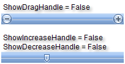

# Handles

## Handles Visibility

Using the **ShowDragHandle**, **ShowDecreaseHandle**, **ShowIncreaseHandle** properties you can control which of the handles will be displayed. By default all the handles are displayed.



Using the **IsSelectionRangeEnabled**, **SelectionStart**, **SelectionEnd** properties you can configure the slider to display two drag handles instead of one.

````ASP.NET
<telerik:radslider id="RadSlider1" runat="server" orientation="horizontal" showdecreasehandle="true"
	showincreasehandle="true" showdraghandle="false" skin="Office2007" />
<br />
<telerik:radslider id="RadSlider2" runat="server" orientation="horizontal" showdecreasehandle="false"
	showincreasehandle="false" showdraghandle="true" skin="Office2007" />
````

````C#
RadSlider1.ShowDecreaseHandle = true;
RadSlider1.ShowIncreaseHandle = true;
RadSlider1.ShowDragHandle = false;
RadSlider2.ShowDecreaseHandle = false;
RadSlider2.ShowIncreaseHandle = false;
RadSlider2.ShowDragHandle = true;
````
````VB
RadSlider1.ShowDecreaseHandle = True
RadSlider1.ShowIncreaseHandle = True
RadSlider1.ShowDragHandle = False
RadSlider2.ShowDecreaseHandle = False
RadSlider2.ShowIncreaseHandle = False
RadSlider2.ShowDragHandle = True
````

## Handles Tooltips

Tooltips are automatically supplied to all three handles and are controlled by the **DecreaseText**, **IncreaseText** and **DragText** properties and have the default values "Decrease", "Increase" and "Drag", respectively.


````ASP.NET
<telerik:radslider id="RadSlider1" runat="server" decreasetext="Lower" increasetext="Raise"
	dragtext="Change" />
````

````C#	
RadSlider1.DecreaseText = "Lower";
RadSlider1.IncreaseText = "Raise";
RadSlider1.DragText = "Change";	
````
````VB	
RadSlider1.DecreaseText = "Lower"
RadSlider1.IncreaseText = "Raise"
RadSlider1.DragText = "Change"	
````


## See Also

 * [Live Demo "Handle Customizations"](https://demos.telerik.com/aspnet-ajax/Slider/Examples/HandlesCustomization/DefaultCS.aspx)

 * [Live demo "Range Slider"](https://demos.telerik.com/aspnet-ajax/Slider/Examples/RangeSlider/DefaultCS.aspx)
