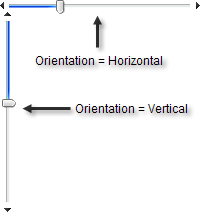

# Layout

Set the **Orientation** property to display the slider **Vertical** or **Horizontal**.



````ASP.NET
<telerik:radslider id="RadSlider1" runat="server" orientation="Horizontal" />
<telerik:radslider id="RadSlider2" runat="server" orientation="Vertical" />
````

````C#
RadSlider1.Orientation = Telerik.Web.UI.Orientation.Horizontal;
RadSlider2.Orientation = Telerik.Web.UI.Orientation.Vertical;
````
````VB
RadSlider1.Orientation = Telerik.Web.UI.Orientation.Horizontal
RadSlider2.Orientation = Telerik.Web.UI.Orientation.Vertical
````


## See Also

 * [Live Demo: "Orientation"](http://demos.telerik.com/aspnet-ajax/Slider/Examples/Orientation/DefaultCS.aspx)
