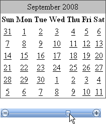

# Getting Started Overview


## 

The following tutorial demonstrates using RadSlider to interact with the month of a Standard ASP.NET Calendar control. The tutorial shows how to set minimum and maximum values, change the current slider value, respond to value changes and set the skin.
>caption 



1. In the default page of a new __ASP.NET AJAX-enabled Web Application__ add a Standard Calendar control and a RadSlider.

1. In the Properties Window for the __Calendar__ control set the __PrevMonthText__ and __NextMonthText__ properties to blank ("").

1. Open the RadSlider [Smart Tag]() and select "Office2007" from the __Skin__ drop down list.

1. In the Properties Window for the RadSlider set the following properties:

* __AutoPostBack__ = __True__

* __MinimumValue =__ 1

* __MaximumValue__ = 12

1. In the Properties Window, click the Events button (). Double-click the [ValueChanged]() event to create an event handler. Replace the event handler with the code below.

>tabbedCode

````C#
	
	    protected void RadSlider1_ValueChanged(object sender, EventArgs e)
	    {
	        Calendar1.VisibleDate = new DateTime(DateTime.Today.Year, (int)RadSlider1.Value, 1);
	    } 
				
````


````VB
	
	    Protected Sub RadSlider1_ValueChanged(ByVal sender As Object, ByVal e As EventArgs)
	        Calendar1.VisibleDate = New DateTime(DateTime.Today.Year, DirectCast(RadSlider1.Value, Integer), 1)
	    End Sub
	
````


>end

1. Replace the Page_Load event handler with the code below:

>tabbedCode

````C#
	
	    protected void Page_Load(object sender, EventArgs e)
	    {
	        if (!IsPostBack)
	        {
	            RadSlider1.Value = Calendar1.VisibleDate.Month;
	        }
	    } 
				
````


````VB
	
	    Protected Sub Page_Load(ByVal sender As Object, ByVal e As EventArgs)
	        If Not IsPostBack Then
	            RadSlider1.Value = Calendar1.VisibleDate.Month
	        End If
	    End Sub
	
````


>end

1. Press __F5__ to run the application. Drag the slider and observe the change to the Calendar. Notice that you can't drag the slider outside the minimum and maximum values of 1..12.

# See Also

 * [Design Time]()

 * [Events]()
