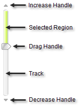

# Structure

## Slider Elements

**RadSlider** was designed to be as simple as possible and consists of the following elements:

* **Increase handle**: Increases the value of the slider by a single step.

* **Selected region**: Visualizes the selected range.

* **Drag handle**: Changes the value of the slider by dragging the handle with the mouse.

* **Track**: Visualizes the slider and changes its value when clicked.

* **Decrease handle**: Decreases the value of the slider by a single step.
