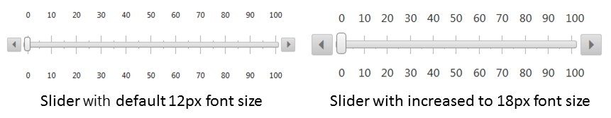

# Responsive, Adaptive and Elastic Capabilities


This article explains the __responsive design capabilities RadSlider offers__. The [ Lightweight RenderMode ]() of __RadSlider__ supports __responsive design since Q2 2014__ and __fluid design since Q3 2014__.

Generally, responsive design means that the page and its content are able to adapt to different screen resolutions without deteriorating the user experience.This often includes changing the font size and having dimensions set in percent.

## Elastic Design with RadSlider

The __Lightweight RenderMode__ of the slider supports changing the font size without breaking the control's appearance -if the new size is larger than the original, the elements in the control will simply increase their size as well to accommodate the text.This fluid layout is achieved by using em units for setting dimensions and paddings in the control, instead of px because em units are tied to the font size.This allows dimensions and sizes to scale with the font size.

The following sample shows how to increase the font size of a slider and the effect can be seen in comparison in __Figure 1__.
>caption Figure 1: Comparison between appearance of a slider with regular font size and with increased font size.



__Example 1__: Slider with increased font size to 18px.

````ASPNET
	        <style type="text/css">
	            div.RadSlider {
	                font-size: 18px;
	            }
	        </style>
	        <telerik:RadSlider ID="RadSlider1" runat="server" RenderMode="Lightweight" Width="400px" Height="100px"
	            ItemType="Tick" SmallChange="5" LargeChange="10">
	        </telerik:RadSlider>
````


## Fluid Design with RadSlider

__RadSlider__ supports setting its __Width__ property in percentage only when Lightweight render mode is enabled as of the Q3 2014 release of UI for ASP.NET AJAX.This means that the slider changes its width according to the current screen resolution when you set its __Width__ property in percentage as shown in__Example 1__. The actual width of the slider is calculated from its parent element, so if you place the slider from __Example 1__ in an HTML div element that is 300px wide, the width of the slider should also be 300px.

__Example 1__: Slider with 100% width.

````ASPNET
	        <telerik:RadSlider ID="RadSlider1" runat="server" Width="100%" RenderMode="Lightweight">
	        </telerik:RadSlider>
````


There are controls and elements that allow you to resize them by dragging their borders, such as the __RadDock__ and __RadWindow__ Telerikcontrols, or HTML elements with drag resizing, enabled via client scripts. If you place a fluid slider in such a container, you need to get the client-side object of the slider and call its __repaint()__ method when you change the size of the container. __Example 2__ shows how to achieve this when you have placed a slider in a __RadDock__ control.

>tip If you place a slider in a __RadSplitter__ control, you will not have to call its __repaint()__ method, because the splitter does this automatically.
>


__Example 2__: Slider with 100% width in a resizable RadDock.

````ASPNET
	        <script type="text/javascript">
	            var slider = null;
	            function OnSliderLoad(sender, eventArgs) {
	                slider = sender;
	            }
	
	            function OnDockResizeEnd(sender, eventArgs) {
	                if (slider != null) slider.repaint();
	            }
	        </script>
	        <telerik:RadDock runat="server" ID="RadDock1" Resizable="true" OnClientResizeEnd="OnDockResizeEnd">
	            <ContentTemplate>
	                <telerik:RadSlider ID="RadSlider1" runat="server" Width="100%" RenderMode="Lightweight" OnClientLoad="OnSliderLoad">
	                </telerik:RadSlider>
	            </ContentTemplate>
	        </telerik:RadDock>
````


# See Also

 * [RadSlider Render Modes]()

 * [RadSlider Client Object]()[Responsive, Adaptive and Elastic Capabilities](42cd0275-a8fe-4ea1-90f8-f15e63b81568)[RadDock Overview](C179C43F-63DD-40BD-9964-867B4F9A303E)[RadWindow Overview](4639D3A8-3908-4C85-BCC7-06AADB4C8153)[RadSplitter Overview](61B3EBA1-3A5F-47E7-9FA8-ADA3B61C5414)
