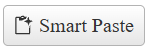

# Getting Started with the SmartPasteButton

This guide demonstrates how to get up and running with the Telerik WebForms SmartPasteButton.

After the completion of this guide, you will be able to achieve the following end result:



## Create the SmartPasteButton

To create the SmartPasteButton in the markup, add a `telerik:RadSmartPasteButton` element to the page and configure its properties like `Icon`, `CancelIcon`, `Text` and `ServiceUrl`.

````ASP.NET
<telerik:RadSmartPasteButton runat="server" ID="SmartPasteButton1" Icon="clipboard-code" CancelIcon="cancel" Text="Smart Paste" ServiceUrl="https://demos.telerik.com/service/v2/ai/smartpaste/smartpaste" />
````

To create the SmartPasteButton on the server, create a new instance of the `RadSmartPasteButton` object, set its options and add it to the Controls collection of another control (e.g. `PlaceHolder1`)

````ASP.NET
<asp:PlaceHolder ID="PlaceHolder1" runat="server"></asp:PlaceHolder>
````

````C#
protected void Page_Init(object sender, EventArgs e)
{
    RadSmartPasteButton smartPasteButton = new RadSmartPasteButton()
    {
        ID = "RadSmartPasteButton1",
        Text = "Smart Paste",
        Icon = "clipboard-code",
        CancelIcon = "cancel",
        ServiceUrl = "https://demos.telerik.com/service/v2/ai/smartpaste/smartpaste",
    };

    PlaceHolder1.Controls.Add(speechToTextButton);
}
````
````VB
Protected Sub Page_Init(ByVal sender As Object, ByVal e As EventArgs)
    Dim smartPasteButton As RadSmartPasteButton = New RadSmartPasteButton() With {
        .ID = "RadSmartPasteButton1",
        .Text = "Smart Paste",
        .Icon = "clipboard-code",
        .CancelIcon = "cancel",
        .ServiceUrl = "https://demos.telerik.com/service/v2/ai/smartpaste/smartpaste"
    }

    PlaceHolder1.Controls.Add(speechToTextButton)
End Sub
````

## Next Steps

- [Change the Appearance]()
- [Form Fields]()
- [Error Handling]()
- [AI Service Integration]()
- [Keyboard Navigation]()
- [Client-side Programming]()
- [Server-side Programming]()
