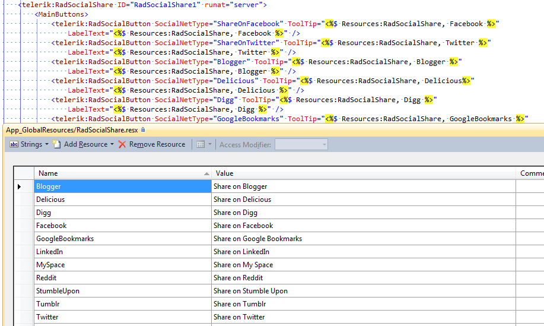

# Localization

## Localizing the Styled Buttons

__RadSocialShare__ provides a mechanism for quick and easy localization, based on the native ASP.NET localization regarding the Styled buttons and following the best practices regarding third party (Standard) buttons. All UI strings for Styled buttons are obtained from the resource files located in the WebSite's __App_GlobalResources__ directory, so that the language of the __RadSocialShare__ Styled buttons is automatically switched to the culture and UI culture of the Web page. As to third party (Standard) buttons, the script parameters are changed according to their documentation when the culture changes.

In order to use this localization you need to add the __*.resx__ files in the __App_GlobalResources__ directory of the site. They have to be in the __RadSocialShare.<language>.resx__ format and you also need the basic file that contains the original strings (RadSocialShare.resx). Then you need to provide the localization string to the chosen property of the Styled button in their markup. The Standard buttons are localized by their owners, not by the developer.

Additionally, each of the localization strings for the Styled buttons can be modified at runtime by using the corresponding property. This saves the need to create a new localization file to change a single string.

## Localizing the Standard Buttons

The [Standard Buttons]() are not rendered by us and we must rely on the localization that the respective network provides. Currently only the __GooglePlusOne__ and the __Facebook__ buttons support localization. We can only follow the instructions they provide and we cannot control the supported languages.

The __Facebook__ buttons follow the [ISO Language convention](http://www.loc.gov/standards/iso639-2/php/code_list.php) and the [ISO 3166-1 Country codes](http://en.wikipedia.org/wiki/ISO_3166-1) and more information about this can be found in the [localization article](http://developers.facebook.com/docs/internationalization/) from their online documentation.

Detailed information about the __GooglePlusOne__ button is available in [the online google documentation](https://developers.google.com/+/plugins/+1button/) and the list with the languages they support is at the end of the page.
