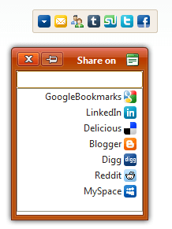

# Right-to-left Support


**RadSocialShare** fully supports right-to-left (RTL) language locales. It is created and added to the page as a child of the form element and in order to turn on the RTL support you should set **dir=rtl to the html or body** element.

````CSS
html
{
    direction: rtl;
} 
````


````ASP.NET
<telerik:RadSocialShare RenderMode="Lightweight" runat="server" ID="RadSocialShare1" UrlToShare="https://www.telerik.com/products/aspnet-ajax.aspx" Skin="Sunset">
    <MainButtons>
        <telerik:RadSocialButton SocialNetType="ShareOnFacebook" />
        <telerik:RadSocialButton SocialNetType="ShareOnTwitter" />
        <telerik:RadSocialButton SocialNetType="StumbleUpon" />
        <telerik:RadSocialButton SocialNetType="Tumblr" />
        <telerik:RadSocialButton SocialNetType="MailTo" />
        <telerik:RadSocialButton SocialNetType="SendEmail" />
        <telerik:RadCompactButton />
    </MainButtons>
</telerik:RadSocialShare>
````



# See Also

 * [Live demo: RadSocialShare RTL Support](https://demos.telerik.com/aspnet-ajax/socialshare/examples/righttoleft/defaultcs.aspx)
