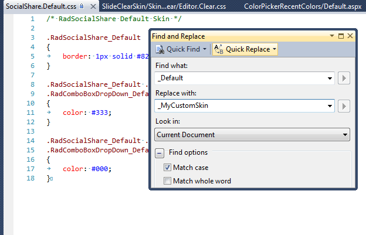
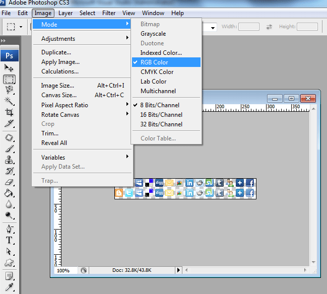
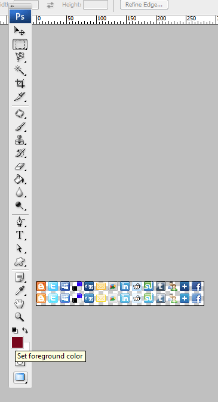
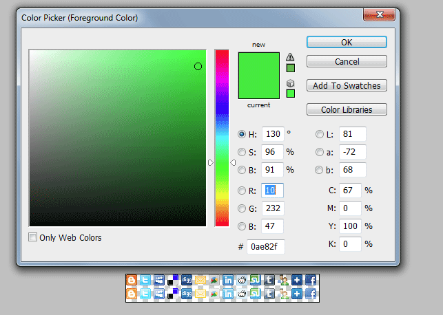
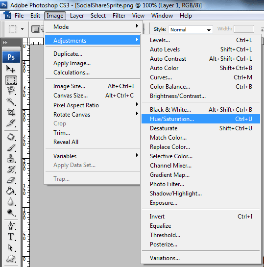
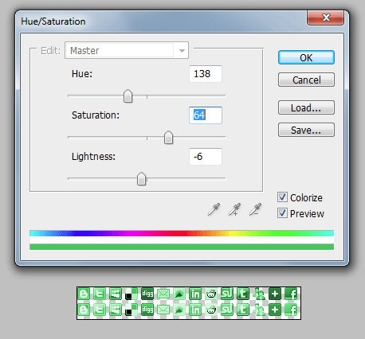

# Creating a Custom Skin

## Creating RadSocialShare Custom Skin

Each of the controls included in the Telerik® UI for ASP.NET AJAX suite is styled by two CSS files that are loaded in a certain order. The first one - ControlName.css, also called the base stylesheet contains CSS properties and values that are common for all skins, i.e. it is layout-specific, not skin-specific. These are CSS float, padding, margin, font-size, font-family, etc. In the general case, when creating a custom skin for a control this file should not be edited, unless the custom skin needs different sizes, paddings or margins. The second file represents the actual skin of the control, and its name consists of the control name plus the skin name, i.e. SocialShare.Default.css. Upon creating a custom skin for the control, one should edit that particular file, as it contains skin-specific CSS properties, and references to images, colors, borders and backgrounds.

## Creating a Custom Skin for RadSocialShare for ASP.NET AJAX from an Existing One

1. In your project, create a new directory named **Skins**

1. In the **Skins** folder create a new directory **MyCustomSkin**

1. Go to ~/**[TelerikControlsInstallationFolder]/Skins/Default** and copy **SocialShare.Default.css** and the **Skins/Default/SocialShare** folder in your **Skins** folder.

1. Rename **SocialShare.Default.css** to **SocialShare.MyCustomSkin.css** and the folder **Default** to **MyCustomSkin**

1. When you are finished you should have **Skins/MyCustomSkin/SocialShare.MyCustomSkin.css** and **Skins/MyCustomSkin/SocialShare**. The last folder contains the images for **MyCustomSkin**

1. In order to support multiple skins of **RadSocialShare** on a single page, the wrapping skin-specific class is coined by the name of the control, **RadSocialShare** plus underscore ("_") plus **SkinName**, i.e., **.RadSocialShare_Default**, so in order to create a custom skin out of the Default skin, we should rename all occurrences of "**Default**" in SocialShare.MyCustomSkin.css to "**MyCustomSkin**" as shown below:

	

1. Add a new server declaration of **RadSocialShare** on your page, and set **Skin="MyCustomSkin" and EnableEmbeddedSkins="false"**:

	__ASP.NET__

	    <telerik:RadSocialShare RenderMode="Lightweight" ID="ssh1" runat="server" EnableEmbeddedSkins="false" Skin="MyCustomSkin">
	    </telerik:RadSocialShare>

1. Register **SocialShare.MyCustomSkin.css** in the `<head>…</head>` section of your webpage.In order to have the CSS applied correctly, the base stylesheet should come first in the DOM:

	__HTML__

	    <link href="Skins/MyCustomSkin/SocialShare.MyCustomSkin.css" rel="stylesheet" type="text/css" />

	Make sure the path to the files is correct; otherwise the skin will not apply.

1. Reload the page, and if the steps 0-8 have been followed correctly, you will see **RadSocialShare** running a custom **Default** skin set as an external resource

## Modifying the Image Sprites to Achieve Totally New Looks for the Skin

Each skin of **RadSocialShare** consists of one image sprite common for all embedded skins which is placed in **Skins/Common/SocialShare/SocialShareSprite.png** . In order to override it for the custom skin, you will need to do the following steps:

1. Copy the sprite from **Skins/Common/SocialShare/** and paste it to **Skins/MyCustomSkin/SocialShare** folder.

1. As in the embedded skin the background image URL is set in the base stylesheet, you have to override it in **SocialShare.MyCustomSkin.css**:

	__CSS__

	    .RadSocialShare_MyCustomSkin .sshIcon
	    {
	        background-image:url(SocialShare/SocialShareSprite.png);
	    }

Explained below is a simple method for modifying the image sprites of **RadSocialShare** with Adobe© PhotoShop to achieve new looks without creating a new design:

1. Drag **SocialShareSprite.png** in Adobe© PhotoShop

1. From the menu bar select Image » Mode » RGB Color to prepare the images for editing (convert from optimized Indexed Color to RGB Color):

	

1. Press Set Foreground Color in PhotoShop's toolbox to invoke the color picker dialog:

	

1. Select a color that you like from the color dialog and then close it:

	

1. Choose the image you will modify, and select Image » Adjustments Hue » / Saturation to open the Hue / Saturation dialog of Adobe© PhotoShop:

	

1. Check the colorize checkbox in the Hue / Saturation dialog, and the image you have selected will be immediately colorized in the hue you have selected from the toolbox:

	

	You may then play with the Hue, Saturation and Lightness sliders to fine tune or further modify the image

1. Press "OK" when you are finished

1. Select Image » Mode » Indexed Color to flatten the layers of the image

1. Save and close the image

1. Repeat Steps 5 - 9 for each of the remaining images

1. Once you are ready, save your work and reload the page. You will have a brand-new skin based on Telerik's **Default** skin of **RadSocialShare**

1. This is not mandatory, but you could decide to change **RadSocialShare** background and border colors to match the newly colorized sprite

# See Also

 * [CSS Skin File Selectors]()

 * [Skins]()

 * [Telerik ThemeBuilder for ASP.NET AJAX](https://themebuilder.telerik.com/)

