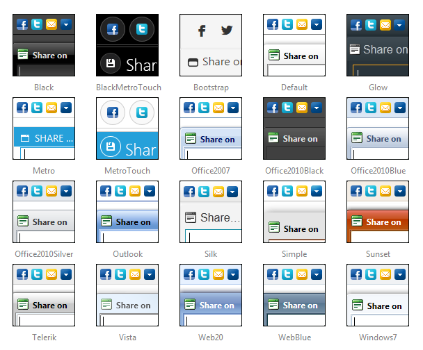

# Skins

## 

To make customizing the appearance of the __RadSocialShare__ as easy as possible, the control uses skins. A skin is a set of images and a CSS stylesheets that are applied to the HTML elements which make up the share bar and popup, defining the look and feel. To apply a skin, set the __Skin__ property of the __RadSocialShare__. You can do so by using the properties pane, the server-side property or the control's Smart Tag.

__RadSocialShare__ is installed with a number of predefined skins:

>note The __Hay__ , __Forest__ , __Sitefinity__ and __Transparent__ skins are obsolete and have been removed from the Telerik.Web.UI.Skins.dll assembly as of __Q1 2014__ .	You can find more information on the matter in[this blog post](http://blogs.telerik.com/aspnet-ajax/posts/13-04-11/6-telerik-asp.net-ajax-skins-going-obsolete).
>

