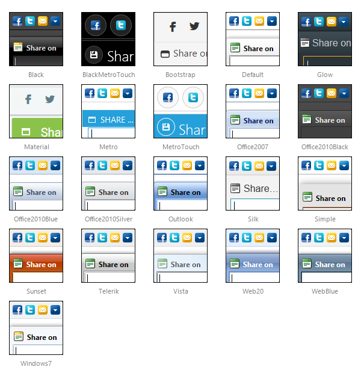

# Skins

To make customizing the appearance of the **RadSocialShare** as easy as possible, the control uses skins. A skin is a set of images and a CSS stylesheets that are applied to the HTML elements which make up the share bar and popup, defining the look and feel. To apply a skin, set the **Skin** property of the **RadSocialShare**. You can do so by using the properties pane, the server-side property or the control's Smart Tag.

**RadSocialShare** is installed with a number of predefined skins: 

 @[template - Material skin is available only in Lightweight mode](/_templates/common/skins-notes.md#material-only-in-lightweight) 

