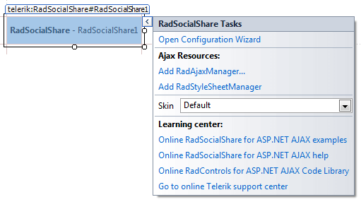
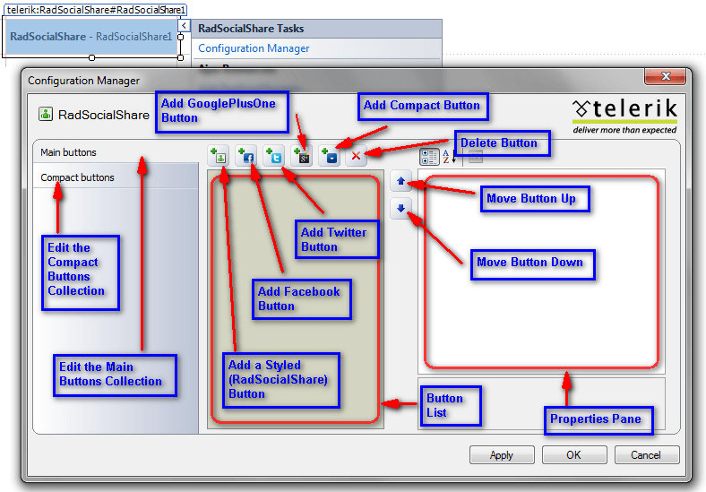

# Design Time

The Smart Tag of __RadSocialShare__ lets you easily select the available buttons, change the skin for your control or quickly get help. You can display the Smart Tag by right clicking on a __RadSocialShare__ control and choosing "Show Smart Tag", or by clicking the small rightward-pointing arrow located in the upper right corner of the control.
>caption 

## Configurator For The Button Lists

The built-in visual designer allows you to easily add the buttons you wish to the __RadSocialShare__ control and it will create the needed markup for you.

The left column lets you choose which of the [Button Collections]() you will modify. By default the __MainButtons__ collection is selected.

In the middle pane you see a list with the already added buttons and the name corresponds to the type of the button - the __SocialNetType__ property for the [Styled Buttons]() and the name for the [Standard Buttons]().

You can add a [Styled Button]() by pressing the first button, the next three are respectively the [Standard Buttons]() for __Facebook__, __Twitter__ and __GooglePlusOne__. The fifth button adds the __RadCompactButton__ and the sixth removes the selected __RadSocialButton__.

You can choose which network the button connects to by directly typing the [Standard Buttons]()'s name (or __SocialNetType__ property for the [Styled Button]()) in the list, or you can select this from the dropdown in the right pane where you can choose all other options.

If you type in a name that does not exist as a possible value for these properties the input will not be taken and the button will be reset to its previous state. Note that the names are case-sensitive. By default the __GoogleBookmarks__[Styled Button]() is added as it is the first one in the aphpabetical order.

If the button type is changed via the properties pane this change is automatically reflected in its name in the list and vice versa.

You can reorder the buttons in the collection by using the two arrows on the right of the list - each click moves the selected button one position up or down the list.

All other properties can be controlled via the right pane which is the standard Properties pane of the Visual Studio. By default only the __SocialNetType__ and the __ToolTip__ are set for each [Styled Button]() and are rendered in the markup. For the Facebook [Standard Button]() only the ButtonType property is selected by default and the Twitter and GooglePlusOne buttons do not need any additional properties initially. You can leave this as-is, or modify the properties as needed.

When working with the CompactButtons collection you can only choose from the [Styled Button]() as they are the only ones that are acceptable for it. Therefore if a name for a [Standard Button]() is entered it will not be taken by the Configurator.

## Ajax Resources

* __Add RadAjaxManager...__ adds a __RadAjaxManager__ component to your Web page, and displays the __r.a.d.ajax Property Builder__ where you can configure it.

* Add __RadStyleSheetManager__ adds a __RadStyleSheetManager__ to your Web page.

## Skin

The __Skin__ drop-down displays a list of available [built-in skins]() that you can apply, along with an example of what the control will look like for each skin. Assign a skin by selecting from the list.

## Learning Center

* Links navigate you directly to examples, help, and code library.

* You can navigate directly to the [Telerik Support Center](http://www.telerik.com/support/home.aspx).

# See Also

 * [Styled Buttons]()

 * [Standard Button]()

 * [Button Collections]()
