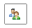

# Sending via E-mail


## Built-in Send E-mail Form

The **RadSocialShare** control offers the ability to send the link, provided in the **UrlToShare** property, via an E-mail, not just to the social networks. In order to do so there is a built-in form that prompts the user for the required information - sender name, e-mail, recipient mail and name, optional subject and message body. The URL can also be altered. There are several requirements to activate this functionality:

1. Add the **SendEmail** button  that will open the form to the **MainButtons** or **CompactButtons** collection of the **RadSocialShare**:

	__ASP.NET__

	    <telerik:RadSocialButton SocialNetType="SendEmail" />


1. Set all the properties from the **EmailSettings** inner tag - **FromEmail** (the e-mail from which the message will ultimately be received by the recipient), **SMTPServer** (the server that will be handling the requests), **UserName** (for the server) and **Password** (for the server). 

	__ASP.NET__

	    <telerik:RadSocialShare ID="RadSocialShare1" runat="server">
	        <EmailSettings SMTPServer="localhost" FromEmail="my@email.com" Password="password"
	            UserName="username" />
	    </telerik:RadSocialShare>


	Alternatively, e-mail settings can be set in the code-behind on every page load (e.g. taken from the web.config's appSettings through the *ConfigurationManager.AppSettings["yourKey"]* appraoch.

>note No server error will be thrown if these properties are not set, yet the e-mail will not be received as there is no server to send it. It is up to the developer to setup the mail server in each individual case according to the custom security policy, requirements and scenario of the site.


## Using the E-mail Agent from the User Machine

The **RadSocialShare** also allows the user to use the system's mail client - for example MS Outlook, Outlook Express, etc. This feature is activated by adding the **MailTo** button  to either the **MainButtons** or **CompactButtons** collection of the **RadSocialShare**:

````ASP.NET
<telerik:RadSocialButton SocialNetType="MailTo" />
````


Clicking this button results in the default mail agent opening a blank e-mail template with the **UrlToShare** property preset as the message body. The User can fully customize the mail and it will be sent from his/her account that is set up in the local software.

# See Also

 * [The `<smtp>` element in the web.config](http://msdn.microsoft.com/en-us/library/ms164240.aspx)
