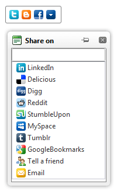

# Getting Started Overview


## 

The following tutorial demonstrates how a simple __RadSocialShare__ control can be used to share an URL. The end result will be similar to the following image once the __CompactButtons__ are shown:

1. In a new AJAX-Enabled Web Application add a __RadSocialShare__ control to the default web page:

````ASPNET
	    <telerik:RadSocialShare runat="server" ID="RadSocialShare1">
	    </telerik:RadSocialShare>
````


1. Set the __UrlToShare__ property to __http://www.telerik.com/products/aspnet-ajax.aspx__ .

1. Set the __TitleToShare__ property to __ASP.NET AJAX Controls, .NET Web UI Components | Telerik__ .

1. Add some buttons to the __MainButtons__ collection. You can choose the social network which they target via the __SocialNetType__ property. For example add a Facebook share button, a Twitter tweet button and a Blogger button. The last button is the __RadCompactButton__ so that you can pop up a __RadWindow__ with the rest of the networks:

````ASPNET
	    <telerik:RadSocialShare runat="server" ID="RadSocialShare1" UrlToShare="http://www.telerik.com/products/aspnet-ajax.aspx"
	            TitleToShare="ASP.NET AJAX Controls, .NET Web UI Components | Telerik">
	        <MainButtons>
	            <telerik:RadSocialButton SocialNetType="ShareOnTwitter" />
	            <telerik:RadSocialButton SocialNetType="Blogger" />
	            <telerik:RadSocialButton SocialNetType="ShareOnFacebook" />
	            <telerik:RadCompactButton />
	        </MainButtons>
	    </telerik:RadSocialShare>
````


1. Press F5 to run the application. You will see a simple bar in the top left corner of the browser. If you click the last button the popup with the rest shows up.
