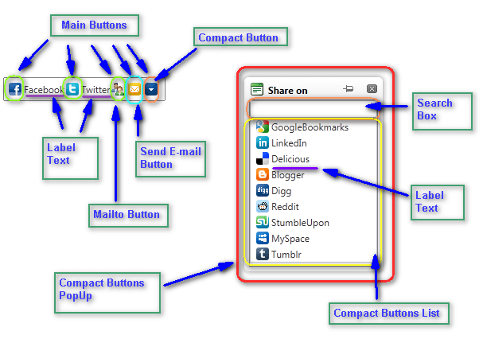

# Structure

## 

The main elements of the **RadSocialShare** control are:

* **MainButtons** - these are the buttons that are always visible on the page

* **CompactButton** - this is an extra button that is not used for sharing, but to show the other available buttons

* **CompactButtons list** - these are the buttons that are not initially visible on the page, yet are easily reachable in a movable popup

* **SearchBox** - you can start typing a social network's name and the **CompactButtons** will be filtered accordingly

* **CompactButtons popup** - the **RadWindow** that holds the additional buttons

* **Send E-mail button** - a button that pops up a form in a **RadWindow** that allows you to send an e-mail via a dedicated server

* **Mailto button** - a button that triggers the system's default mail client to send an e-mail via the user machine

* **Label Text** - the text associated with the button. It can be set explicitly via a property. The CompactButtons have a predefined value which is used for the Search Box even if you do not set the label explicitly.
