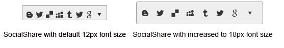

# Elastic Design


This article explains the **elastic design capabilities RadSocialShare offers**. The [Lightweight RenderMode]() of RadSocialShare supports **elastic design as of Q3 2015** (**Figure 1**). The Classic RenderMode offers more limited abilities (**Figure 2**). RadSocialShare also provides [Fluid Design]().

@[template](/_templates/common/render-mode.md#resp-design-desc "slug-el: no, slug-fl: socialshare/mobile-support/fluid-design")

@[template](/_templates/common/font-size-notes.md#note-and-example "control: RadSocialShare")

>caption Figure 1: Comparison between the appearance of a RadSocialShare with regular font size and with increased font size when `RenderMode=Lightweight`. See the code in **Examples 2-3**.



>caption Figure 2: Comparison between the appearance of a RadSocialShare with regular font size and with increased font size when `RenderMode=Classic`. See the code in **Example 4**.


**RadSocialShare** does not create elastic design by itself, but can fit in a page that follows this pattern. This means that its **Lightweight RenderMode** supports **changing the font size** without breaking the control's appearance - if the new size is larger than the original, the elements in the control will simply increase their size as well to accommodate the text. This fluid layout is achieved by using `em` units for setting dimensions and paddings in the control, instead of `px`because `em` units are tied to the font size. This allows dimensions and sizes to scale with the font size.


>note **RadSocialShare** takes the font-size of the page automatically. If the developer does not set it explicitly (**Example 1**), this is up to the client's browser and a common default value is 16px.


>caption **Example 2**: Setting default font for the page with the default value for the Telerik controls.

```CSS
body {
	font-size: 12px; /* 12px is the default value for Telerik controls */
	font-family: "Segoe UI", Arial, Sans-serif;
}
````


>caption **Example 3**: Changing the font-size of a RadSocialShare via a page-wide CSS rule. 

````CSS
body
{
	font-size: 18px;
	font-family: "Segoe UI", Arial, Sans-serif;
}
````

````ASP.NET
<telerik:RadSocialShare RenderMode="Lightweight" runat="server" ID="RadSocialShare1">
	<MainButtons>
		<telerik:RadSocialButton SocialNetType="Blogger" />
		<telerik:RadSocialButton SocialNetType="ShareOnTwitter" ToolTip="Tweet this" />
		<telerik:RadSocialButton SocialNetType="Delicious" ToolTip="Share on Delicious" />
		<telerik:RadSocialButton SocialNetType="MySpace" ToolTip="Share on MySpace" />
		<telerik:RadSocialButton SocialNetType="Tumblr" ToolTip="Share on Tumblr" />
		<telerik:RadSocialButton SocialNetType="ShareOnTwitter" ToolTip="Tweet this" />
		<telerik:RadSocialButton SocialNetType="GoogleBookmarks" ToolTip="Share on GoogleBookmarks" />
		<telerik:RadCompactButton />
	</MainButtons>
</telerik:RadSocialShare>
````


>caption **Example 4**: Changing the font-size of a RadSocialShare via the control's properties. 

````ASP.NET
<telerik:RadSocialShare Font-Size="18px" RenderMode="Lightweight" runat="server" ID="RadSocialShare1">
	<MainButtons>
		<telerik:RadSocialButton SocialNetType="Blogger" />
		<telerik:RadSocialButton SocialNetType="ShareOnTwitter" ToolTip="Tweet this" />
		<telerik:RadSocialButton SocialNetType="Delicious" ToolTip="Share on Delicious" />
		<telerik:RadSocialButton SocialNetType="MySpace" ToolTip="Share on MySpace" />
		<telerik:RadSocialButton SocialNetType="Tumblr" ToolTip="Share on Tumblr" />
		<telerik:RadSocialButton SocialNetType="ShareOnTwitter" ToolTip="Tweet this" />
		<telerik:RadSocialButton SocialNetType="GoogleBookmarks" ToolTip="Share on GoogleBookmarks" />
		<telerik:RadCompactButton />
	</MainButtons>
</telerik:RadSocialShare>
````

>caption **Example 5**: Changing the font-size of a RadSocialShare a specific CSS rule for, primarily for the Classic RenderMode.

````CSS
div.RadSocialShare {
    font-size: 18px;
}
````

````ASP.NET
<telerik:RadSocialShare runat="server" ID="ssh1" EnableEmbeddedSkins="true" Skin="Silk" Width="100%" Height="200px">
    <MainButtons>
        <telerik:RadSocialButton SocialNetType="Blogger" />
        <telerik:RadSocialButton SocialNetType="ShareOnTwitter" ToolTip="Tweet this" />
        <telerik:RadSocialButton SocialNetType="Delicious" ToolTip="Share on Delicious" />
        <telerik:RadSocialButton SocialNetType="MySpace" ToolTip="Share on MySpace" />
        <telerik:RadSocialButton SocialNetType="Tumblr" ToolTip="Share on Tumblr" />
        <telerik:RadSocialButton SocialNetType="ShareOnTwitter" ToolTip="Tweet this" />
        <telerik:RadSocialButton SocialNetType="GoogleBookmarks" ToolTip="Share on GoogleBookmarks" />
        <telerik:RadCompactButton />
    </MainButtons>
</telerik:RadSocialShare>
````


# See Also


 * [Render Modes]()

 * [Fluid Design]()

@[template](/_templates/common/font-size-notes.md#related-resources)

