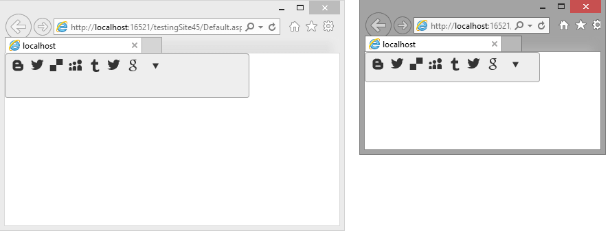

# Elastic Design


This article explains the **fluid design capabilities RadSocialShare offers**. 

@[template](/_templates/common/render-mode.md#resp-design-desc "slug-el: socialshare/mobile-support/elastic-design, slug-fl: no")


>caption Figure 1: RadSocialShare with dimensions set to 100% that occupies its entire parent element




You can set the **Width** and **Height** properties of the **RadSocialShare** in **percent**. This lets it resize together with its parent element.


>caption **Example 1**: A RadSocialShare that resizes with the parent element.

```CSS
html, body, form
{
	height: 100%;
	margin: 0;
	padding: 0;
}
<div style="width: 70%; height: 20%;">
	<telerik:RadSocialShare  RenderMode="Lightweight" runat="server" ID="RadSocialShare1" Width="100%" Height="100%">
		<MainButtons>
			<telerik:RadSocialButton SocialNetType="Blogger" />
			<telerik:RadSocialButton SocialNetType="ShareOnTwitter" ToolTip="Tweet this" />
			<telerik:RadSocialButton SocialNetType="Delicious" ToolTip="Share on Delicious" />
			<telerik:RadSocialButton SocialNetType="MySpace" ToolTip="Share on MySpace" />
			<telerik:RadSocialButton SocialNetType="Tumblr" ToolTip="Share on Tumblr" />
			<telerik:RadSocialButton SocialNetType="ShareOnTwitter" ToolTip="Tweet this" />
			<telerik:RadSocialButton SocialNetType="GoogleBookmarks" ToolTip="Share on GoogleBookmarks" />
			<telerik:RadCompactButton />
		</MainButtons>
	</telerik:RadSocialShare>
</div>
````


# See Also


 * [Render Modes]()

 * [Elastic Design]()


