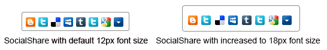

# Responsive, Adaptive and Elastic Capabilities


This article explains the __responsive design capabilities RadSocialShare offers__.	RadSocialShare is built semantically, using CSS for defining rounded corners, shadows and gradients. In the examplebellow you will find a very simple way, allowing you to resize and scale the control only by	changing its default font size.

Generally, responsive design means that the page and its content are able to adapt to different screen resolutions without deteriorating	the user experience. This often includes changing the font size and having dimensions set in percent.

## Elastic Design with RadSocialShare
>caption Figure 1: Comparison between appearance of a RadSocialShare with regular font size and with increased font size



__RadSocialShare__ does not create elastic design by itself, but can fit in a page that follows this pattern.	This means that RadSocialShare does not support dimensions set in percent, but supports __changing the font size__	without breaking the control's appearance - if the new size is larger than the original,the elements in the control will simply increase their size as well to accommodate the text.This fluid layout is achieved by using `em` units for setting dimensions and paddings in the control, instead of `px`because `em` units are tied to the font size. This allows dimensions and sizes to scale with the font size.

Elements that use images or images sprites, however, cannot be increased in size, so the icons will not be resized, but border radius and padding	inside the wrapping element are scaled properly based on the chosen font size.

The following sample shows how to increase the font size of a RadSocialShare and the effect can be seen in comparison in Figure 1.

````ASPNET
		<style type="text/css">
			div.RadSocialShare {
				font-size: 18px !important;
			}
		</style>
		<telerik:RadSocialShare runat="server" ID="ssh1" EnableEmbeddedSkins="true" Skin="Silk" Width="100%" Height="200px">
			<MainButtons>
				<telerik:RadSocialButton SocialNetType="Blogger" />
				<telerik:RadSocialButton SocialNetType="ShareOnTwitter" ToolTip="Tweet this" />
				<telerik:RadSocialButton SocialNetType="Delicious" ToolTip="Share on Delicious" />
				<telerik:RadSocialButton SocialNetType="MySpace" ToolTip="Share on MySpace" />
				<telerik:RadSocialButton SocialNetType="Tumblr" ToolTip="Share on Tumblr" />
				<telerik:RadSocialButton SocialNetType="ShareOnTwitter" ToolTip="Tweet this" />
				<telerik:RadSocialButton SocialNetType="GoogleBookmarks" ToolTip="Share on GoogleBookmarks" />
				<telerik:RadCompactButton />
			</MainButtons>
		</telerik:RadSocialShare>
````


