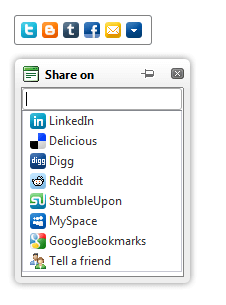

# SocialShare Overview

**RadSocialShare** is a control that allows you to easily connect your site with the **popular social networks** or let the user send an **e-mail** with the link. It creates a centralized bar in which you can choose in which networks your users will be able to share the content. You are also allowed to make only a handful of the buttons visible initially and place the rest in a popup with a search box.

Key features:

* Easy [customization of the content the user shares]()

	* The current page or custom URL

	* The developer can preset the title of the post the user will share, this overriding the page's title / URL

* Two types of sharing buttons:

	* [Styled buttons]() - by default provide consistent look, size and icons for the most popular features of the social networks, yet can be fully customized in terms of size, icon, text and tooltip
	
	* [Standard buttons]() - they are rendered by the social networks themselves and provide their full functionality

* [Two buttons collections]() to fully customize the look and feel of the control

	* **Main Buttons** - these are always shown on the page and the social network is only a click away
	
	* **Compact Buttons** - If you do not want to overload the page with buttons deemed as rarely used you can leave the rest in a popup that gets opened via the RadCompactButton.

* [Visual Button Configurator]() that allows you toconfigure the button collections quickly and without writing a single line of code

* Ability to [send the URL as an e-mail]()

	* Via the **default mail client from the user's machine**, thus from the user's own account
	
	* Via a **built-in mail form** that sends the e-mail on behalf of the user from an address and server declared by the developer

* Easy [integration with Google Analytics]()

* [Client-side events]() which allow you to thank the user or prevent multiple clicks

* The popular [Telerik skinning mechanism]() to match the rest of the site

# See Also

 * [Controlling the content the user shares]()

 * [Styled buttons]()

 * [Standard buttons]()

 * [Buttons collections]()

 * [Send an e-mail]()

 * [Integration with Google Analytics]()

 * [Client-side events]()
