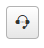
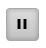
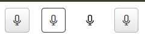
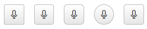
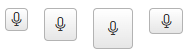
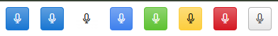

# Appearance

In this article, you will find information about the styling options and rendering of the WebForms SpeechToTextButton.

For a live example, visit the [Appearance Demo of the SpeechToTextButton](https://demos.telerik.com/aspnet-ajax/speechtotextbutton/appearance/defaultcs.aspx).

## Options

The WebForms SpeechToTextButton supports the following styling options:

- [`Icon`](#icon) - Configures the icon displayed when the button is in inactive state.
- [`StopIcon`](#stopicon) - Configures the icon displayed when the button is speech recognition state.
- [`FillMode`](#fillmode) - Configures how the color is applied to the component.
- [`Rounded`](#rounded) - Configures the border radius of the component.
- [`Size`](#size) - Configures the overall size of the component.
- [`ThemeColor`](#theme-color) - Configures what color will be applied to the component.

## Icon

The `Icon` option determines which icon is displayed when the button is not in the active state. The default is the `microphone-outline` icon.



Example

````ASP.NET
<telerik:RadSpeechToTextButton runat="server" ID="RadSpeechToTextButton1" Icon="headset" />
````

## StopIcon

The `StopIcon` option determines which icon is displayed when the button is in the active state (speech recognition in progress). The default is the `stop-sm` icon.



Example

````ASP.NET
<telerik:RadSpeechToTextButton runat="server" ID="RadSpeechToTextButton1" StopIcon="pause-sm" />
````

## FillMode

The `FillMode` option controls how the color is applied to the button.



Available values:

- `Solid` - Solid background color (default)
- `Outline` - Outlined border with transparent background
- `Flat` - No border or background color
- `None`

````ASP.NET
<telerik:RadSpeechToTextButton runat="server" ID="RadSpeechToTextButton1" FillMode="Solid" />
<telerik:RadSpeechToTextButton runat="server" ID="RadSpeechToTextButton2" FillMode="Outline" />
<telerik:RadSpeechToTextButton runat="server" ID="RadSpeechToTextButton3" FillMode="Flat" />
<telerik:RadSpeechToTextButton runat="server" ID="RadSpeechToTextButton4" FillMode="None" />
````

## Rounded

The `Rounded` option controls the border radius of the button.



Available values:

- `Small` - Small border radius
- `Medium` - Medium border radius (default)
- `Large` - Large border radius
- `Full` - Fully rounded corners (pill shape)
- `None`

````ASP.NET
<telerik:RadSpeechToTextButton runat="server" ID="RadSpeechToTextButton1" Rounded="Small" />
<telerik:RadSpeechToTextButton runat="server" ID="RadSpeechToTextButton2" Rounded="Medium" />
<telerik:RadSpeechToTextButton runat="server" ID="RadSpeechToTextButton3" Rounded="Large" />
<telerik:RadSpeechToTextButton runat="server" ID="RadSpeechToTextButton4" Rounded="Full" />
<telerik:RadSpeechToTextButton runat="server" ID="RadSpeechToTextButton5" Rounded="None" />
````

## Size

The `Size` option controls how big or small the rendered button looks.




Available values:

- `Small` - Small size
- `Medium` - Medium size (default)
- `Large` - Large size
- `None`

````ASP.NET
<telerik:RadSpeechToTextButton runat="server" ID="RadSpeechToTextButton1" Size="Small" />
<telerik:RadSpeechToTextButton runat="server" ID="RadSpeechToTextButton2" Size="Medium" />
<telerik:RadSpeechToTextButton runat="server" ID="RadSpeechToTextButton3" Size="Large" />
<telerik:RadSpeechToTextButton runat="server" ID="RadSpeechToTextButton5" Size="None" />
````

## Theme Color

The `ThemeColor` option controls the color applied to the button.



Available values:

- `Primary` - Primary accent color
- `Secondary` - Secondary accent color
- `Tertiary` - Tertiary accent color
- `Info` - Informational color
- `Success` - Positive action color
- `Warning` - Attention‑drawing color
- `Error` - Negative action color
- `Base` - Default color based on the current theme

````ASP.NET
<telerik:RadSpeechToTextButton runat="server" ID="RadSpeechToTextButton1" ThemeColor="Primary" />
<telerik:RadSpeechToTextButton runat="server" ID="RadSpeechToTextButton2" ThemeColor="Secondary" />
<telerik:RadSpeechToTextButton runat="server" ID="RadSpeechToTextButton3" ThemeColor="Tertiary" />
<telerik:RadSpeechToTextButton runat="server" ID="RadSpeechToTextButton4" ThemeColor="Info" />
<telerik:RadSpeechToTextButton runat="server" ID="RadSpeechToTextButton5" ThemeColor="Success" />
<telerik:RadSpeechToTextButton runat="server" ID="RadSpeechToTextButton6" ThemeColor="Warning" />
<telerik:RadSpeechToTextButton runat="server" ID="RadSpeechToTextButton7" ThemeColor="Error" />
<telerik:RadSpeechToTextButton runat="server" ID="RadSpeechToTextButton8" ThemeColor="Base" />
````

## Button States

* **Inactive State** - Default state before speech recognition begins
* **Active State** - Indicates that speech recognition is currently in progress
* **Error State** - Displays when speech recognition encounters an error or is not supported by the browser

## Next Steps

- [Accessibility]()
- [Client-side Programming]()
- [Server-side Programming]()
