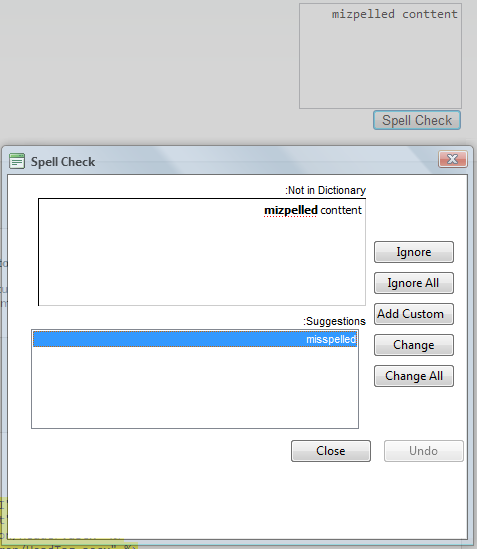

# Right-to-left Support


## 

The **RadSpell** fully supports right-to-left (RTL) language locales. In order to turn on the RTL support you should set its **DialogsCssFile** property to an external CSS file in which you have the **direction: rtl** property set for the html or body element.

````ASPNET
	body
	{
	    direction: rtl;
	}
````


````ASPNET
	<div dir="rtl">
	     <asp:TextBox ID="TextBox1" runat="server" Height="100" TextMode="MultiLine">mizpelled conttent</asp:TextBox><br />
	     <telerik:RadSpell ID="RadSpell1" runat="server" ControlToCheck="TextBox1" DialogsCssFile="dialogsRTL.css" />
	</div>
````



# See Also

 * [See this live in an online demo](http://demos.telerik.com/aspnet-ajax/spell/examples/righttoleft/defaultcs.aspx)
